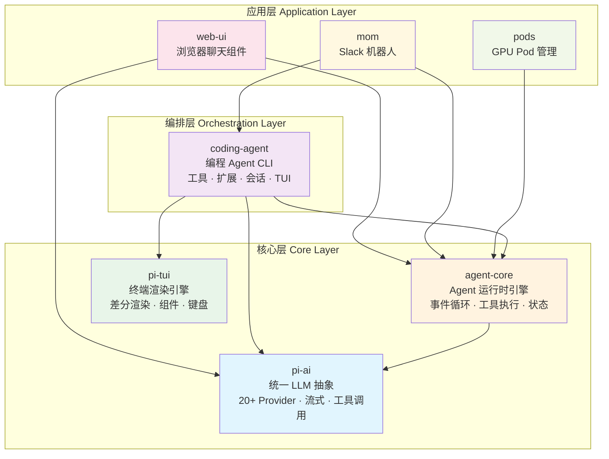
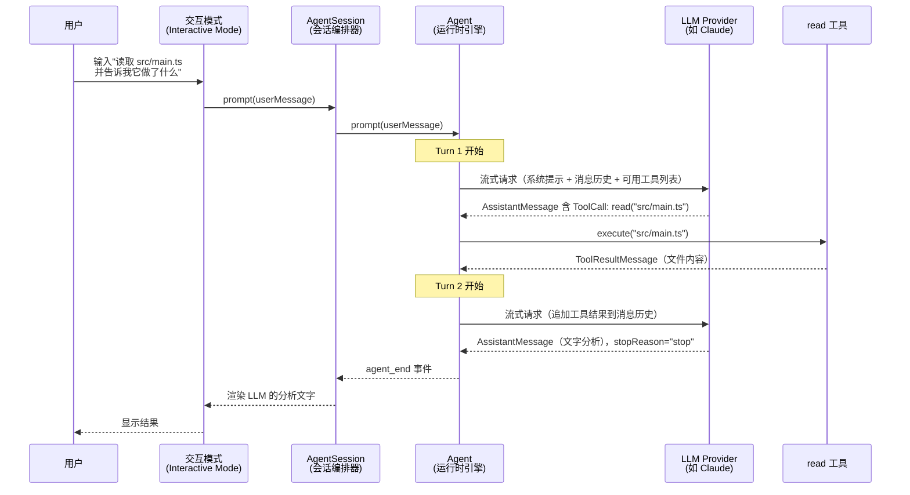
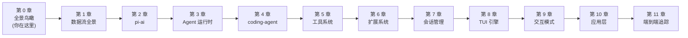

# 第 0 章：全景鸟瞰

> 在深入任何一行代码之前，我们先花 15 分钟建立一张"全局地图"。有了这张地图，后续每一章的深入都不会迷路。

---

## Pi 是什么

Pi 是一套**用 TypeScript 编写的 AI Agent 工具链**。它的核心目标是：让开发者能够构建、运行、扩展可以自主执行编程任务的 AI 助手。

你可以把 Pi 想象成一个"AI 编程助手的操作系统"——它解决了从"LLM 只会说话"到"LLM 能读文件、改代码、跑命令"之间的全部工程问题。

具体来说，Pi 提供了：

| 能力 | 说明 |
|------|------|
| **统一的 LLM 调用** | 一套 API 调用 20+ 家 LLM（OpenAI、Anthropic、Google 等），自动处理差异 |
| **Agent 运行时** | 让 LLM 进入"思考 → 调用工具 → 获得结果 → 再思考"的自主循环 |
| **编程工具集** | 读文件、写文件、编辑代码、执行 Shell 命令——Agent 的"手" |
| **终端 IDE** | 功能完整的终端交互界面，像 IDE 一样使用 AI |
| **扩展机制** | 不需要 Fork，用 TypeScript 文件就能添加工具、修改行为 |
| **多种接入方式** | 终端 TUI、JSON-RPC、SDK、Web 组件、Slack 机器人 |

---

## 架构全景图

Pi 是一个 Monorepo（单仓库多包），包含 7 个包，分为三层：



**每一层解决什么问题：**

**核心层**解决"基础设施"问题：
- **pi-ai** —— 屏蔽 20+ 家 LLM Provider 的 API 差异，提供统一的流式调用接口。它是整个项目的地基。（[详见第 2 章](ch02-pi-ai.md)）
- **pi-agent-core** —— 在 pi-ai 之上，构建"思考-行动"循环。它让 LLM 不再只是聊天，而是能自主调用工具、处理结果、继续推理。（[详见第 3 章](ch03-agent-core.md)）
- **pi-tui** —— 一个独立的终端 UI 渲染引擎，支持差分渲染、组件化、Overlay 浮层。它是终端交互界面的底层支撑。（[详见第 8 章](ch08-tui-engine.md)）

**编排层**解决"产品化"问题：
- **coding-agent** —— 把运行时引擎包装成一个可用的编程助手：CLI 入口、6 个内置工具（read/write/edit/bash/find/grep）、扩展系统、会话持久化、上下文压缩、多种运行模式（TUI/Print/RPC/SDK）。（[详见第 4 章](ch04-coding-agent.md)）

**应用层**解决"多端接入"问题：
- **web-ui** —— 浏览器端的聊天界面 Web 组件，支持 Artifacts、文件上传、会话管理。（[详见第 10 章](ch10-applications.md)）
- **mom** —— Slack 机器人，把 coding-agent 的能力接入 Slack，支持 Docker 沙箱隔离执行。（[详见第 10 章](ch10-applications.md)）
- **pods** —— GPU Pod 上的 vLLM 部署管理 CLI，管理自托管模型。（[详见第 10 章](ch10-applications.md)）

---

## 核心概念词典

在阅读后续章节之前，你需要知道这些概念。它们会反复出现。

### Provider（提供商）

LLM 的服务提供方。比如 OpenAI 提供 GPT-4o，Anthropic 提供 Claude，Google 提供 Gemini。每家的 API 格式不同，pi-ai 的核心工作就是把这些差异藏起来。

### Message（消息）

Pi 中所有对话都由三种消息组成：

| 消息类型 | 角色 | 说明 |
|---------|------|------|
| **UserMessage** | `"user"` | 用户说的话（文本或图片） |
| **AssistantMessage** | `"assistant"` | LLM 的回复（文本、思考过程、或工具调用请求） |
| **ToolResultMessage** | `"toolResult"` | 工具执行后的结果，回传给 LLM |

这三种消息交替出现，构成了整个对话历史。

### Tool Calling（工具调用）

LLM 本身只能生成文字。但当你告诉它"你有这些工具可以用"，它可以在回复中说"我要调用 read 工具读取 src/main.ts 这个文件"。Pi 的 Agent 运行时收到这个请求后，真的去执行操作，把结果作为 ToolResultMessage 发回给 LLM，LLM 看到结果后继续思考。

这个"请求 → 执行 → 返回结果"的过程就是工具调用。

### Turn（轮次）

Agent 的一次完整"思考-行动"周期。一个 Turn 包含：
1. LLM 生成一条 AssistantMessage（可能包含工具调用）
2. 如果有工具调用：执行所有工具，收集结果
3. Turn 结束

如果工具执行完后 LLM 还想继续，就会开始新的 Turn。多个 Turn 串联，直到 LLM 认为任务完成。

### Streaming（流式响应）

LLM 不是一次性返回完整回复，而是一个 token 一个 token 地"流"出来。Pi 用事件流（Event Stream）统一表达这个过程——你会看到 `text_delta`（新文字片段）、`toolcall_end`（工具调用解析完毕）、`done`（响应结束）等事件。

### Session（会话）

一次完整的对话，包含所有消息历史。Pi 把会话以 JSONL（每行一个 JSON 对象）格式保存到磁盘，支持**分支**（从历史某个点分叉出新对话）和**压缩**（用 LLM 总结旧消息释放空间）。

### Extension（扩展）

一个 TypeScript 文件，导出一个函数。通过事件钩子机制，扩展可以在 Agent 执行的关键节点介入——拦截工具调用、注入系统提示、添加自定义工具、注册斜杠命令。这是 Pi 的核心扩展机制，让用户"不 Fork 就能定制一切"。

---

## 代码库地图

```
pi-mono/
├── packages/
│   ├── ai/                  ← pi-ai：LLM 抽象层（~25,000 行）
│   │   └── src/
│   │       ├── types.ts            核心类型定义（Message, Tool, Model...）
│   │       ├── stream.ts           stream() / complete() 入口函数
│   │       ├── api-registry.ts     Provider 注册表
│   │       ├── models.ts           模型注册与查询
│   │       ├── providers/          各 Provider 适配器
│   │       │   ├── anthropic.ts        Anthropic/Claude
│   │       │   ├── openai-completions.ts  OpenAI + 兼容 Provider
│   │       │   ├── google.ts           Google Gemini
│   │       │   └── ...                 Bedrock, Mistral, Azure 等
│   │       └── utils/              事件流、JSON 解析、校验等
│   │
│   ├── agent/               ← pi-agent-core：Agent 运行时（~1,900 行）
│   │   └── src/
│   │       ├── types.ts            AgentState, AgentTool, AgentEvent
│   │       ├── agent.ts            Agent 类（状态机 + 事件订阅）
│   │       └── agent-loop.ts       核心执行循环（两层循环）
│   │
│   ├── coding-agent/        ← 编程 Agent CLI（~44,000 行）
│   │   └── src/
│   │       ├── cli.ts              CLI 入口
│   │       ├── main.ts             main() 启动编排
│   │       ├── core/
│   │       │   ├── agent-session.ts    会话编排器
│   │       │   ├── tools/              6 个内置工具
│   │       │   ├── extensions/         扩展系统（加载/运行/类型）
│   │       │   ├── session-manager.ts  JSONL 会话持久化
│   │       │   ├── compaction/         上下文压缩
│   │       │   └── system-prompt.ts    系统提示词构建
│   │       └── modes/
│   │           ├── interactive/        TUI 交互模式（30+ 组件）
│   │           ├── print-mode.ts       打印/JSON 输出模式
│   │           └── rpc/                JSON-RPC 进程间通信模式
│   │
│   ├── tui/                 ← 终端 UI 引擎（~6,100 行）
│   │   └── src/
│   │       ├── tui.ts              差分渲染引擎 + Overlay 系统
│   │       ├── keys.ts             键盘输入解析（Kitty 协议）
│   │       ├── utils.ts            文本宽度计算 + ANSI 处理
│   │       └── components/         编辑器、选择列表、Markdown 等组件
│   │
│   ├── web-ui/              ← 浏览器聊天组件（Web Components）
│   ├── mom/                 ← Slack 机器人
│   └── pods/                ← GPU Pod vLLM 管理
│
├── package.json             Monorepo 根配置（npm workspaces）
├── tsconfig.base.json       共享 TypeScript 配置
└── biome.json               代码格式化和 Lint 配置
```

---

## 一次典型交互的极简全流程

为了建立直觉，我们先用最简单的场景走一遍完整路径：**用户在终端输入"读取 src/main.ts 并告诉我它做了什么"，Pi 完成这个任务。**



**整个过程经历了 6 个站点：**

1. **用户输入** → TUI 捕获键盘输入，组装成 UserMessage
2. **会话编排** → AgentSession 构建系统提示、准备工具列表、调用 Agent
3. **LLM 请求** → Agent 运行时把消息历史和工具定义发给 LLM，LLM 流式返回
4. **工具执行** → LLM 回复中包含工具调用请求（"我要读 src/main.ts"），Agent 执行 read 工具，把文件内容作为 ToolResultMessage 追加到消息历史
5. **二次推理** → Agent 把包含工具结果的消息历史再次发给 LLM，LLM 给出最终分析
6. **结果呈现** → 文字流式传回 TUI，逐字显示给用户

后续章节将逐一打开这些站点的黑盒。[第 1 章](ch01-data-flow.md)会更细致地追踪每一步的数据变化，[第 2 章](ch02-pi-ai.md)起开始深入每个组件的内部实现。

---

## 从全景到细节的阅读路径

本书的章节顺序遵循一个原则：**在你知道"这东西是干嘛的"之前，不讲它内部怎么实现。**



先建全局直觉（第 0-1 章），再自底向上打开核心层黑盒（第 2-3 章），然后进入编排层（第 4-7 章），接着是 UI 体系（第 8-9 章），最后是应用层变体和端到端验证（第 10-11 章）。

准备好了吗？让我们从[第 1 章](ch01-data-flow.md)开始，跟踪一次完整交互中数据的每一次变化。

---

### 质检报告

**讲解节奏**
- [x] 每个模块先讲"它是什么"再讲"里面有什么"

**周边知识**
- [x] 设计决策处有足够背景（解释了 Monorepo、Provider 差异、工具调用的必要性）
- [x] 没有跨度过大的段落

**讲透了吗**
- [x] 核心流程每一步解释了数据变化（典型交互的 6 个站点）
- [x] 没有跳步
- [x] 复杂节点已标注"详见第 N 章"

**代码纪律**
- [x] 全章代码片段 0 处
- [x] 完全用文字、表格和流程图表达

**流程图准确性**
- [x] 架构全景图的依赖关系经过 package.json 确认
- [x] 交互序列图的步骤经过 agent-loop.ts 和 agent-session.ts 源码确认
- [x] 图下方有逐步文字解释且与图完全对应

**过渡自然吗**
- [x] 章头以"建立全局地图"引入
- [x] 章尾以"准备好了吗？"引出第 1 章
- [x] 章内各节以因果关系衔接

**准确吗**
- [x] 行业标准术语使用正确
- [x] 项目特有术语（AgentSession, Turn, Steering 等）已解释
- [x] 代码行数经 `wc -l` 确认

**读得下去吗**
- [x] 术语首次出现有解释
- [x] 每张图有文字讲解

**勘误建议**
- 无
