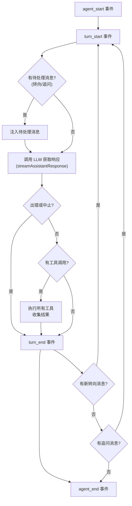
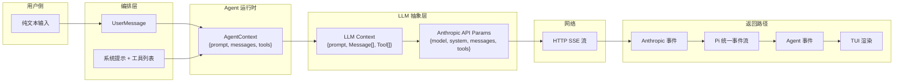

# 第 1 章：数据流全景 —— 一次完整的编程对话

> [上一章](ch00-panorama.md)我们建立了全局地图——知道了 Pi 的七个包和三层架构。但那只是静态的"零件清单"。这一章，我们要让这台机器"转起来"：追踪一次真实交互中，数据从用户键盘到 LLM 服务器再到本地文件系统的完整旅程。

---

## 场景设定

用户在终端启动 `pi`，进入交互模式，输入：

> 读取 src/index.ts 文件，告诉我它的主要导出有哪些

这个简单的请求会经历**两个完整的 Turn**：第一个 Turn 里 LLM 决定调用 `read` 工具读取文件；第二个 Turn 里 LLM 根据文件内容给出分析。我们将逐站追踪数据的形态变化。

---

## 站点一：用户输入 → UserMessage

用户在 TUI 编辑器中输入文字，按下回车。交互模式（InteractiveMode）捕获这段文字，将它包装成一条标准的 `UserMessage`：

```
数据形态：
{
  role: "user",
  content: [{ type: "text", text: "读取 src/index.ts 文件，告诉我它的主要导出有哪些" }],
  timestamp: 1711567200000
}
```

这条消息传递给 AgentSession 的 `prompt()` 方法。

**调用路径：**

```
packages/coding-agent/src/modes/interactive/interactive-mode.ts
  — TUI 编辑器捕获用户输入文本
  — 组装为纯文本字符串
→ packages/coding-agent/src/core/agent-session.ts::prompt(text)
  — 输入：用户文本字符串
  — 检查是否是斜杠命令（以 "/" 开头）→ 不是
  — 触发扩展 "input" 事件（扩展可拦截或修改）→ 无拦截
  — 检查是否匹配 Skill 或 Prompt Template → 不匹配
  — 继续进入下一站
```

---

## 站点二：AgentSession 编排

AgentSession 是 coding-agent 的核心编排器。收到用户文本后，它要做三件关键的事：**构建系统提示**、**通知扩展**、**调用 Agent 运行时**。

### 2.1 构建系统提示

系统提示（System Prompt）是给 LLM 的"角色说明书"。AgentSession 通过 `buildSystemPrompt()` 动态组装它，包含以下部分：

| 段落 | 内容 | 来源 |
|------|------|------|
| 角色定义 | "你是一个专业的编程助手" | 硬编码模板 |
| 可用工具 | 列出当前激活的工具名称和简述 | 根据 `selectedTools` 动态生成 |
| 使用准则 | 工具使用的注意事项和最佳实践 | 根据可用工具自动拼接 |
| 项目上下文 | 项目的 README 等文件内容 | 用户配置的 `contextFiles` |
| 技能描述 | Skill 文件的内容（扩展能力描述） | `~/.pi/agent/skills/` 中的 Markdown 文件 |
| 当前环境 | 日期、工作目录 | 运行时检测 |

**调用路径：**

```
packages/coding-agent/src/core/system-prompt.ts::buildSystemPrompt(options)
  — 输入：selectedTools, skills, contextFiles, appendSystemPrompt 等
  — 为每个已激活工具生成使用片段（toolSnippets）
  — 拼接角色定义 + 工具列表 + 准则 + 上下文 + 技能 + 环境
  — 输出：完整的系统提示字符串（通常几千字）
```

### 2.2 通知扩展系统

在调用 Agent 之前，AgentSession 触发 `before_agent_start` 扩展事件。扩展可以：
- 修改系统提示（追加或替换）
- 注入额外的消息到对话开头
- 动态增删工具

如果没有扩展，这一步直接跳过。

### 2.3 调用 Agent 运行时

AgentSession 把用户消息包装成 `AgentMessage[]`，连同系统提示一起传给 Agent：

**调用路径：**

```
packages/coding-agent/src/core/agent-session.ts::prompt(text)
  — 构建 UserMessage：{ role: "user", content: [...], timestamp }
  — 如有扩展注入的消息，追加到消息数组前面
  — 设置系统提示（扩展修改后的 或 默认构建的）
→ packages/agent/src/agent.ts::prompt(messages: AgentMessage[])
  — 输入：AgentMessage 数组（通常只有一条 UserMessage）
  — 标记 isStreaming = true
  — 调用内部 _runLoop(messages)
```

---

## 站点三：Agent 运行时 —— 两层循环启动

Agent 的 `_runLoop()` 是整个系统的心脏。它构建执行上下文，然后进入核心循环。

### 3.1 构建执行上下文

`_runLoop()` 做的第一件事是把当前状态拍一个快照，构建 `AgentContext` 和 `AgentLoopConfig`：

```
AgentContext（执行上下文）:
{
  systemPrompt: "你是一个专业的编程助手...（完整系统提示）",
  messages: [...之前的消息历史..., 本次用户消息],
  tools: [read, write, edit, bash, find, grep]  ← 6 个内置工具定义
}

AgentLoopConfig（循环配置）:
{
  model: { id: "claude-sonnet-4-20250514", provider: "anthropic", ... },
  reasoning: "medium",
  toolExecution: "parallel",
  convertToLlm: (agentMessages) => llmMessages,  ← 消息转换函数
  getSteeringMessages: () => [...],               ← 获取转向消息
  getFollowUpMessages: () => [...],               ← 获取追问消息
  beforeToolCall: (ctx) => ...,                    ← 工具执行前钩子
  afterToolCall: (ctx) => ...                      ← 工具执行后钩子
}
```

注意 `convertToLlm` 函数——它负责把 `AgentMessage[]`（可能包含自定义消息类型）转换成 LLM 能理解的标准 `Message[]`。这是 Agent 层和 LLM 层之间的关键桥梁。

### 3.2 两层循环结构

构建完上下文后，Agent 进入 `runAgentLoop()`，内部是一个**两层循环**：



**这张图的关键逻辑：**

1. **外层循环**（Follow-up 驱动）：当 Agent 处理完所有工具调用且没有转向消息时，检查是否有追问消息。如果有，把追问消息当作新的待处理消息，重新进入内层循环。

2. **内层循环**（Tool Call + Steering 驱动）：每次循环先处理待处理消息（转向消息或追问消息），然后调用 LLM 获取响应。如果响应包含工具调用，执行工具、收集结果、检查是否有新的转向消息，有则继续循环。

3. **退出条件**：LLM 的响应不包含工具调用，也没有转向消息，也没有追问消息——Agent 认为任务完成。

在我们的场景中，流程是：进入 → 无待处理消息 → 调用 LLM → LLM 请求 read 工具 → 执行工具 → 无转向消息 → 再次调用 LLM → LLM 给出文字回复（无工具调用）→ 无转向消息 → 无追问消息 → 结束。

---

## 站点四：LLM 请求 —— 从 Agent 消息到 Provider 流式调用

内层循环的核心动作是 `streamAssistantResponse()`。它把 Agent 层的数据转换成 LLM 能理解的格式，然后发起流式请求。

### 4.1 消息转换管道

消息经过两步转换：

```
AgentMessage[]
    ↓ config.transformContext()  — 可选：裁剪、重排、去重
AgentMessage[]
    ↓ config.convertToLlm()     — 必须：过滤自定义类型，保留标准 Message
Message[]（LLM 能理解的格式）
```

转换后，构建 LLM 上下文：

```
LLM Context:
{
  systemPrompt: "你是一个专业的编程助手...",
  messages: [
    { role: "user", content: [...], timestamp: ... }
  ],
  tools: [
    { name: "read", description: "读取文件内容", parameters: { path, offset?, limit? } },
    { name: "write", description: "写入文件", parameters: { ... } },
    { name: "edit", description: "编辑文件", parameters: { ... } },
    { name: "bash", description: "执行命令", parameters: { ... } },
    { name: "find", description: "查找文件", parameters: { ... } },
    { name: "grep", description: "搜索内容", parameters: { ... } }
  ]
}
```

### 4.2 Provider 路由

这个 LLM 上下文被传给 pi-ai 的 `streamSimple()` 函数。它做了两件事：

1. **查找 Provider**：根据 `model.api`（比如 `"anthropic-messages"`）在 Provider 注册表（`apiProviderRegistry`）中查找对应的 Provider 适配器
2. **委托调用**：调用该 Provider 的 `streamSimple()` 方法

**调用路径：**

```
packages/agent/src/agent-loop.ts::streamAssistantResponse()
  — 输入：AgentContext + AgentLoopConfig
  — 转换消息：AgentMessage[] → Message[]
  — 构建 LLM 上下文
→ packages/ai/src/stream.ts::streamSimple(model, context, options)
  — 输入：model, LLM Context, 流式选项
  — 调用 resolveApiProvider(model.api) 在注册表中查找 Provider
  — 调用 provider.streamSimple(model, context, options)
→ packages/ai/src/providers/anthropic.ts::streamAnthropic(model, context, options)
  — 输入：Model + Context + Options
  — 用 Anthropic SDK 转换消息格式
  — 调用 client.messages.stream() 发起流式 HTTP 请求
  — 逐事件解析返回的 SSE 流
```

### 4.3 Provider 内部：以 Anthropic 为例

Anthropic Provider 把 Pi 的统一消息格式转换成 Anthropic API 需要的格式：

| Pi 格式 | Anthropic 格式 |
|---------|---------------|
| `systemPrompt` 字符串 | `system` 数组（带 cache_control） |
| `UserMessage.content[].text` | `{ type: "text", text: "..." }` |
| `Tool.parameters`（TypeBox Schema） | `input_schema`（JSON Schema） |
| `ThinkingLevel "medium"` | `thinking: { type: "enabled", budget_tokens: N }` |

转换完成后，调用 `client.messages.stream()` 发起请求。Anthropic 服务器以 SSE（Server-Sent Events）流式返回响应。

### 4.4 流式事件统一化

每家 Provider 返回的事件格式不同——Anthropic 用 `content_block_delta`，OpenAI 用 `choices[0].delta`。pi-ai 的每个 Provider 适配器负责把自家格式转换成统一的 `AssistantMessageEvent` 流：

```
Provider 原始事件 → Pi 统一事件:

"content_block_start" (thinking) → { type: "thinking_start" }
"content_block_delta" (text)     → { type: "text_delta", delta: "文件" }
"content_block_delta" (text)     → { type: "text_delta", delta: "的主要" }
"content_block_start" (tool_use) → { type: "toolcall_start" }
"content_block_delta" (tool args)→ { type: "toolcall_delta", delta: '{"path":' }
"content_block_stop"  (tool_use) → { type: "toolcall_end", toolCall: { name: "read", arguments: { path: "src/index.ts" } } }
"message_delta" (end_turn)       → { type: "done", message: 最终 AssistantMessage }
```

这些统一事件逐个向上传播：Provider → `streamSimple()` → Agent Loop → Agent → AgentSession → TUI。TUI 收到 `text_delta` 就逐字显示，收到 `toolcall_end` 就准备展示工具调用。

---

## 站点五：工具执行 —— Agent 的"手"

LLM 的第一次响应包含一个工具调用：`read({ path: "src/index.ts" })`。Agent 循环收到这个响应后，进入工具执行阶段。

### 5.1 响应数据形态

此时 AssistantMessage 长这样：

```
AssistantMessage（第一次 LLM 响应）:
{
  role: "assistant",
  content: [
    { type: "text", text: "我来读取这个文件。" },
    { type: "toolCall", id: "call_abc123", name: "read", arguments: { path: "src/index.ts" } }
  ],
  stopReason: "toolUse",    ← 表示"我还没说完，等工具结果"
  usage: { input: 1250, output: 48, cost: { total: 0.0042 } },
  ...
}
```

`stopReason: "toolUse"` 是关键信号——它告诉 Agent 循环"别停，我需要工具的结果才能继续"。

### 5.2 工具执行流程

Agent 循环从 AssistantMessage 中提取所有 ToolCall，然后逐个（或并行）执行：

**调用路径：**

```
packages/agent/src/agent-loop.ts::executeToolCalls(toolCalls, context, config, ...)
  — 输入：ToolCall 数组 + 执行上下文
  — 对每个 ToolCall：
    1. 查找工具定义（从 context.tools 中按 name 匹配）
    2. 验证参数（用 JSON Schema 校验 arguments）
    3. 调用 config.beforeToolCall()（扩展可拦截或阻止）
    4. 调用 tool.execute(toolCallId, validatedArgs, signal, onUpdate)
    5. 调用 config.afterToolCall()（扩展可修改结果）
    6. 构建 ToolResultMessage
  — 输出：ToolResultMessage 数组
```

### 5.3 read 工具的执行

以 `read` 工具为例：

**调用路径：**

```
packages/coding-agent/src/core/tools/read.ts::execute("call_abc123", { path: "src/index.ts" })
  — 输入：toolCallId + { path: "src/index.ts" }
  — 解析路径：相对路径 → 绝对路径（基于当前工作目录）
  — 检查文件权限（是否可读）
  — 检查是否为图片（MIME 类型检测）→ 不是
  — 读取文件内容（UTF-8）
  — 检查截断：如果超过 500 行或 512KB，只返回前 500 行并提示"用 offset 参数读取后续"
  — 输出：{ content: [{ type: "text", text: "1. import { ... }\n2. export ...\n..." }], details: { truncation } }
```

### 5.4 工具结果数据形态

执行结果被包装成 `ToolResultMessage`：

```
ToolResultMessage:
{
  role: "toolResult",
  toolCallId: "call_abc123",     ← 对应 LLM 发出的 ToolCall ID
  toolName: "read",
  content: [{ type: "text", text: "文件内容（带行号）..." }],
  isError: false,
  timestamp: 1711567201000
}
```

这条消息被追加到消息历史中。现在消息历史变成了：

```
消息历史：
1. UserMessage     — "读取 src/index.ts 文件，告诉我它的主要导出有哪些"
2. AssistantMessage — "我来读取这个文件。" + ToolCall(read)
3. ToolResultMessage — 文件内容
```

---

## 站点六：二次推理 → 最终响应

内层循环回到顶部：有工具调用 → 执行完毕 → 检查转向消息（无）→ 回到循环顶部 → 无待处理消息 → 再次调用 LLM。

这一次，LLM 看到的消息历史包含了文件内容。它不再需要任何工具，直接给出分析回答：

```
AssistantMessage（第二次 LLM 响应）:
{
  role: "assistant",
  content: [
    { type: "text", text: "src/index.ts 的主要导出包括：\n\n1. `stream` / `complete` — 流式和同步 LLM 调用\n2. ..." }
  ],
  stopReason: "stop",       ← 表示"我说完了"
  usage: { input: 2800, output: 320, cost: { total: 0.012 } },
  ...
}
```

`stopReason: "stop"` 告诉 Agent 循环：这一轮结束了。循环检查：
- 有工具调用？**否**
- 有转向消息？**否**
- 有追问消息？**否**
- → 发出 `agent_end` 事件，退出循环

### 最终消息历史

整个交互结束后，消息历史定格为四条：

```
1. UserMessage       — 用户的问题
2. AssistantMessage  — LLM 第一次回复（含 ToolCall）
3. ToolResultMessage — read 工具的执行结果
4. AssistantMessage  — LLM 最终分析回答
```

这四条消息会被 SessionManager 以 JSONL 格式追加写入磁盘（[详见第 7 章](ch07-sessions.md)），下次恢复会话时可以完整还原。

---

## 站点七：结果呈现

Agent 循环产生的每个事件都沿着事件链向上传播：

```
Agent Loop 事件
    ↓ Agent._processLoopEvent()
Agent 状态更新 + 事件广播
    ↓ AgentSession 事件订阅
AgentSession 事件（enriched，包含会话信息）
    ↓ InteractiveMode 事件订阅
TUI 组件更新
    ↓ 差分渲染
终端输出（用户看到的）
```

**文字流式显示**：每个 `text_delta` 事件到达 TUI 时，TUI 的差分渲染引擎只更新变化的行，不重绘整个屏幕。用户看到文字像打字一样逐渐出现。（[详见第 8 章](ch08-tui-engine.md)）

**工具调用展示**：当 `tool_execution_start` 事件到达时，TUI 显示一个折叠的工具调用区块（"▸ read src/index.ts"）。工具完成后更新为结果摘要。

**Token 与费用**：Footer 组件实时更新 Token 消耗和费用统计。

---

## 全程数据变化总结



每个箭头都是一次数据格式转换。这就是为什么 Pi 需要多层抽象——每层负责一种转换，上层不需要知道下层的具体格式。

到这里，你应该对数据的完整流动路径有了清晰的直觉。接下来，我们从最底层开始，逐个打开黑盒。[第 2 章](ch02-pi-ai.md)将深入 pi-ai——那个把 20+ 家 LLM 差异全部藏起来的统一抽象层。

---

### 质检报告

**讲解节奏**
- [x] 每个站点先讲"这一步在做什么"再讲"数据长什么样"

**周边知识**
- [x] 解释了 SSE、stopReason 的含义
- [x] 没有跨度过大的段落

**讲透了吗**
- [x] 7 个站点每步都展示了数据形态
- [x] 没有跳步——从用户输入到屏幕输出完整覆盖
- [x] 复杂节点标注了"详见第 N 章"

**代码纪律**
- [x] 全章代码片段 0 处（所有数据形态展示使用的是数据结构示意，不是可执行代码）
- [x] 用调用路径和数据形态描述代替了代码

**流程图准确性**
- [x] 两层循环流程图基于 agent-loop.ts 源码确认
- [x] 序列图基于 agent.ts::prompt() 和 agent-session.ts::prompt() 源码确认
- [x] 图下方有逐步文字解释

**过渡自然吗**
- [x] 章头衔接第 0 章（"上一章建立了地图，这一章让机器转起来"）
- [x] 章尾引出第 2 章（"从最底层开始打开黑盒"）
- [x] 站点之间以数据流动自然衔接

**准确吗**
- [x] read 工具的截断阈值（500 行/512KB）经源码确认
- [x] Agent 两层循环结构经 agent-loop.ts 确认
- [x] Anthropic 消息转换经 anthropic.ts 确认

**读得下去吗**
- [x] 每个站点开头都说明"这一步做什么"
- [x] 数据形态用缩进伪 JSON 展示，不是代码
- [x] 流程图有完整的文字解读

**勘误建议**
- 无
