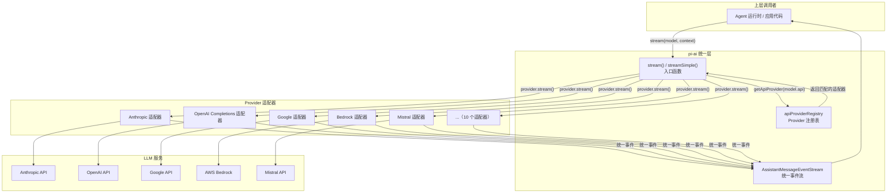
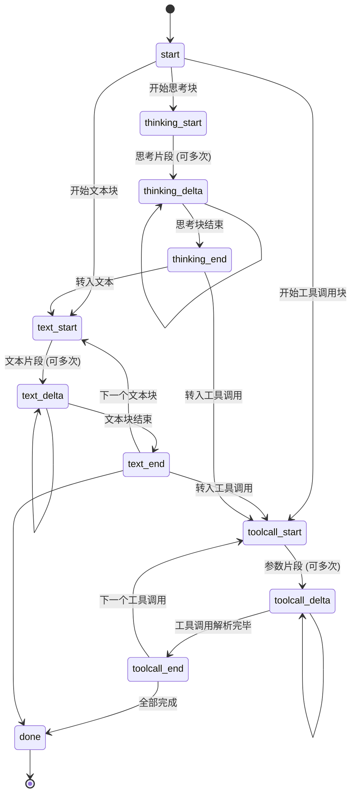
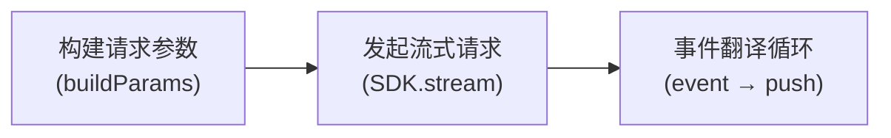

# 第 2 章：pi-ai —— 统一的 LLM 抽象层

> [上一章](ch01-data-flow.md)我们追踪了一次完整交互中数据的流动。当 Agent 循环需要"调 LLM 获取响应"时，它调用了 `streamSimple()` 函数——这就是 pi-ai 的入口。这一章，我们打开这个黑盒，看看它如何把 20+ 家风格各异的 LLM API 统一成一套接口。

---

## pi-ai 解决什么问题

不同 LLM Provider 的 API 差异巨大。仅举几例：

| 差异点 | Anthropic | OpenAI | Google Gemini |
|--------|-----------|--------|---------------|
| 消息格式 | `system` 独立字段 | `messages` 中的 `"system"` 角色 | `systemInstruction` 字段 |
| 工具调用 | `type: "tool_use"` | `tool_calls` 数组 | `functionCall` 字段 |
| 流式协议 | SSE，事件类型各异 | SSE，`choices[0].delta` | SSE，自有事件格式 |
| 思考/推理 | `thinking` content block | `reasoning_content` delta 字段 | `thought` 布尔标记 |
| 认证方式 | API Key | API Key 或 OAuth | API Key 或 OAuth 或 ADC |

如果让上层代码直接对接每家 API，每次加一个 Provider 就要改所有使用 LLM 的代码。pi-ai 的目标是：**上层只需要一次调用 `stream(model, context)`，不管底层是哪家 Provider**。

这种设计模式叫**适配器模式**（Adapter Pattern）：每家 Provider 有自己的适配器，把自家格式转换成统一接口。

---

## 整体架构



**从上到下，三个层次：**

1. **入口函数**（`stream()` / `streamSimple()`）：接收统一的 Model + Context，从注册表查找对应 Provider，委托调用。
2. **Provider 注册表**（`apiProviderRegistry`）：一个 Map，以 API 标识符（如 `"anthropic-messages"`）为 key，以 Provider 适配器为 value。
3. **Provider 适配器**：每个适配器把统一格式翻译成自家 SDK 格式，发起请求，把自家事件格式翻译回统一事件。

下面逐层展开。

---

## 统一的消息类型

在了解入口函数之前，我们先认识 pi-ai 定义的三种核心消息类型。它们是所有 Provider 的"通用语言"：

| 类型 | 角色 | 携带内容 | 什么时候出现 |
|------|------|---------|------------|
| **UserMessage** | `"user"` | 文本和/或图片 | 用户发言 |
| **AssistantMessage** | `"assistant"` | 文本、思考过程、工具调用请求 | LLM 回复 |
| **ToolResultMessage** | `"toolResult"` | 文本和/或图片 + 工具执行元信息 | 工具执行完毕后回传 |

AssistantMessage 的 `content` 字段是一个数组，可以混合包含三种内容块：

| 内容块类型 | 含义 | 典型来源 |
|-----------|------|---------|
| **TextContent** | LLM 生成的文字 | 所有模型 |
| **ThinkingContent** | LLM 的推理过程（"思考链"） | Claude、o1/o3、Gemini 等支持推理的模型 |
| **ToolCall** | 工具调用请求（工具名 + 参数） | 所有支持 Tool Calling 的模型 |

这意味着一条 AssistantMessage 可以同时包含"我先想想"（ThinkingContent）、"分析结果是..."（TextContent）、"我需要读取这个文件"（ToolCall）——三种内容块共存。

---

## 入口函数：stream() 和 streamSimple()

pi-ai 提供两对入口函数：

| 函数 | 返回 | 特点 |
|------|------|------|
| `stream(model, context, options?)` | `AssistantMessageEventStream` | 接受 Provider 特定的选项（如 Anthropic 的 `cacheRetention`） |
| `complete(model, context, options?)` | `Promise<AssistantMessage>` | `stream()` 的便捷版——等待流结束，返回最终消息 |
| `streamSimple(model, context, options?)` | `AssistantMessageEventStream` | 接受统一的 `SimpleStreamOptions`（自动处理 `thinkingLevel` 到各 Provider 的映射） |
| `completeSimple(model, context, options?)` | `Promise<AssistantMessage>` | `streamSimple()` 的便捷版 |

Agent 运行时通常使用 `streamSimple()`——它自动把"我要 medium 级别的推理"翻译成每家 Provider 理解的参数。

### 调用流程

`streamSimple()` 的内部逻辑非常简洁：

**调用路径：**

```
packages/ai/src/stream.ts::streamSimple(model, context, options)
  — 输入：Model 对象 + Context（系统提示 + 消息 + 工具）+ SimpleStreamOptions
  — 步骤 1：调用 resolveApiProvider(model.api)
      → packages/ai/src/api-registry.ts::getApiProvider(api)
        — 在 apiProviderRegistry（Map）中按 api 字符串查找
        — 返回 Provider 适配器 或 undefined
      — 如果 undefined → 抛错 "No API provider registered"
  — 步骤 2：调用 provider.streamSimple(model, context, options)
      — 委托给具体 Provider 的流式函数
  — 输出：AssistantMessageEventStream（统一事件流）
```

`stream()` 的逻辑完全相同，只是调用 `provider.stream()` 而非 `provider.streamSimple()`。

---

## Provider 注册表：懒加载机制

20+ 个 Provider 如果在启动时全部加载，会拖慢启动速度并引入不必要的依赖。pi-ai 用**懒加载**解决这个问题。

### 注册时机

`register-builtins.ts` 在 Pi 启动时执行，但它**不会立即导入任何 Provider 模块**。它只是向注册表注册了"加载函数"——真正的 import 在第一次使用时才发生。

### 懒加载模式

每个 Provider 的注册遵循相同模式：

1. 声明一个缓存变量（初始为 `undefined`）
2. 定义一个加载函数，用 `||=` 运算符确保只导入一次
3. 在注册表中注册一个"代理流函数"，首次调用时触发真正的 import

**调用路径：**

```
packages/ai/src/providers/register-builtins.ts
  — 启动时运行，为每个 API 注册懒加载代理
  — 以 Anthropic 为例：
    — 声明 anthropicProviderModulePromise = undefined（缓存）
    — loadAnthropicProviderModule()：
        — 首次调用：import("./anthropic.js")，缓存 Promise
        — 后续调用：直接返回缓存的 Promise
    — 注册到 apiProviderRegistry：
        — api: "anthropic-messages"
        — stream: createLazyStream(loadAnthropicProviderModule, "stream")
        — streamSimple: createLazyStream(loadAnthropicProviderModule, "streamSimple")
  — createLazyStream() 的工作：
    — 返回一个函数，调用时先 await 加载模块，再调用模块的流函数
    — 如果加载失败，推送 error 事件到事件流（不会崩溃）
```

这意味着：如果你只用 Anthropic 模型，OpenAI、Google 等 Provider 的代码永远不会被加载。

### 注册了哪些 Provider

| API 标识符 | Provider | 适配器文件 |
|-----------|----------|-----------|
| `anthropic-messages` | Anthropic (Claude) | `anthropic.ts` |
| `openai-completions` | OpenAI + 10 个兼容 Provider | `openai-completions.ts` |
| `openai-responses` | OpenAI Responses API | `openai-responses.ts` |
| `azure-openai-responses` | Azure OpenAI | `azure-openai-responses.ts` |
| `openai-codex-responses` | OpenAI Codex | `openai-codex-responses.ts` |
| `google-generative-ai` | Google Gemini | `google.ts` |
| `google-vertex` | Google Vertex AI | `google-vertex.ts` |
| `google-gemini-cli` | Google Gemini CLI | `google-gemini-cli.ts` |
| `bedrock-converse-stream` | AWS Bedrock | `amazon-bedrock.ts` |
| `mistral-conversations` | Mistral | `mistral.ts` |

其中 `openai-completions` 的适配器被复用了——因为 Groq、Cerebras、xAI、OpenRouter、Ollama、vLLM 等 Provider 都兼容 OpenAI Chat Completions API，只需要不同的 `baseUrl` 和 API Key。

---

## 统一事件流：AssistantMessageEventStream

Provider 适配器不是一次性返回完整消息，而是逐事件推送。pi-ai 用 `AssistantMessageEventStream` 统一这个过程。

### EventStream 的工作原理

`AssistantMessageEventStream` 继承自泛型 `EventStream`。EventStream 的核心思想是：**生产者推事件，消费者异步迭代**。

它内部维护一个队列和一个等待者列表：

- 当生产者调用 `push(event)` 时，如果有消费者在等待，直接交付；否则放入队列
- 当消费者用 `for await (const event of stream)` 迭代时，如果队列有事件，直接取出；否则等待
- 当 `done` 或 `error` 事件到达时，流结束，最终的 AssistantMessage 通过 `stream.result()` 获取

### 事件类型

流中按顺序出现的事件：



**典型事件序列**（LLM 先说一句话再调用工具）：

```
start → text_start → text_delta("我来") → text_delta("读取") → text_end
      → toolcall_start → toolcall_delta('{"path":') → toolcall_delta('"src/index.ts"}')
      → toolcall_end(ToolCall { name: "read", arguments: { path: "src/index.ts" } })
      → done(AssistantMessage)
```

每个 Provider 适配器的核心工作就是：**把自家的流式事件翻译成这个统一序列**。

---

## Provider 适配器的内部结构

每个 Provider 适配器都遵循相同的模式。我们以 Anthropic 和 OpenAI 为例剖析。

### 适配器的通用三步



1. **构建请求参数**：把 Pi 的统一 Context 转换成该 Provider SDK 需要的参数格式
2. **发起流式请求**：用该 Provider 的官方 SDK 发起 HTTP 流式请求
3. **事件翻译循环**：遍历 Provider 返回的原始事件，逐个翻译成 Pi 统一事件并推入 EventStream

### Anthropic 适配器

**调用路径：**

```
packages/ai/src/providers/anthropic.ts::streamAnthropic(model, context, options)
  — 步骤 1：构建参数
    — 创建 Anthropic SDK client（根据 OAuth/API Key 选择认证方式）
    — buildParams()：
      — 把 context.systemPrompt 转为 Anthropic 的 system 数组格式
      — 把 context.messages 通过 convertMessages() 转为 Anthropic MessageParam[]
      — 把 context.tools 转为 Anthropic 的 input_schema 格式
      — 根据 thinkingLevel 配置 thinking 参数（enabled + budget_tokens）
      — 添加 cache_control 标记（Anthropic 的 prompt caching 机制）
  — 步骤 2：发起请求
    — client.messages.stream({ model, system, messages, tools, max_tokens, stream: true })
  — 步骤 3：事件翻译
    — message_start → 提取 usage（input tokens, cache read/write）
    — content_block_start(text) → push text_start
    — content_block_start(thinking) → push thinking_start
    — content_block_start(tool_use) → push toolcall_start
    — content_block_delta(text_delta) → push text_delta
    — content_block_delta(thinking_delta) → push thinking_delta
    — content_block_delta(input_json_delta) → push toolcall_delta + 流式 JSON 解析
    — content_block_stop → push 对应的 *_end
    — message_delta → 提取 stopReason, 累计 output tokens
    — 最终 → 计算费用，push done 或 error
```

### OpenAI Completions 适配器

OpenAI Chat Completions API 与 Anthropic 的格式完全不同，但适配器让上层无感知：

**调用路径：**

```
packages/ai/src/providers/openai-completions.ts::streamOpenAICompletions(model, context, options)
  — 步骤 1：构建参数
    — 创建 OpenAI SDK client
    — buildParams()：
      — 根据模型是否支持 reasoning，把 systemPrompt 设为 "developer" 或 "system" 角色
      — convertMessages()：
        — UserMessage → { role: "user", content: [...] }
        — AssistantMessage → { role: "assistant", content: text, tool_calls: [...] }
        — ToolResultMessage → { role: "tool", tool_call_id: "...", content: "..." }
      — tools → { type: "function", function: { name, description, parameters } }
      — 根据兼容性配置选择 max_tokens 或 max_completion_tokens 字段
  — 步骤 2：发起请求
    — client.chat.completions.create({ model, messages, tools, stream: true })
  — 步骤 3：事件翻译
    — OpenAI 的流式格式是 chunk-based：每个 chunk 包含 choices[0].delta
    — delta.content → text_delta
    — delta.reasoning_content → thinking_delta
    — delta.tool_calls[i].function.arguments → toolcall_delta + 流式 JSON 解析
    — chunk.usage → token 统计
    — finish_reason → 映射到 Pi 的 stopReason
```

### 兼容 Provider 的秘密

Groq、Cerebras、xAI、OpenRouter、Ollama 等 Provider 都复用 `openai-completions.ts` 这个适配器。它们之间的差异通过 Model 对象上的 `compat` 字段处理：

| 兼容性选项 | 作用 | 典型场景 |
|-----------|------|---------|
| `maxTokensField` | 用 `max_tokens` 还是 `max_completion_tokens` | 旧版 API 用前者 |
| `supportsReasoningEffort` | 是否支持 `reasoning_effort` 参数 | 仅部分 Provider 支持 |
| `requiresToolResultName` | ToolResult 消息是否需要 `name` 字段 | 部分 Provider 要求 |
| `requiresAssistantAfterToolResult` | ToolResult 后是否需要插入空的 Assistant 消息 | 部分 Provider 要求 |
| `thinkingFormat` | 思考内容的格式（openai/openrouter/qwen 等） | 各家格式不同 |

这些选项在 Model 注册时就配好了，适配器根据它们做细微调整——同一份代码服务于十几个 Provider。

---

## 跨 Provider 消息转换

还有一个容易被忽视的问题：**如果用户在对话中切换了模型**（比如从 Claude 切到 GPT-4o），之前 Claude 生成的消息需要经过转换才能被 GPT-4o 理解。

`transform-messages.ts` 负责这个转换，采用两遍扫描：

**第一遍（逐消息转换）：**
- 思考块（ThinkingContent）：如果当前模型和产生该消息的模型不同，丢弃加密的思考内容（不同模型无法解密），保留未加密的思考内容转为普通文本
- 工具调用 ID：不同 Provider 的 ID 格式不同（Anthropic 用 `toolu_xxx`，OpenAI 用 `call_xxx`），转换为当前 Provider 要求的格式
- 文本内容：清理 Unicode 代理对等编码问题

**第二遍（修复结构问题）：**
- 孤儿工具调用：如果某个 ToolCall 没有对应的 ToolResult（比如之前的执行被中断了），插入一条合成的错误 ToolResult，否则 LLM 会困惑
- 错误消息过滤：跳过 `stopReason` 为 `"error"` 或 `"aborted"` 的 AssistantMessage

---

## 模型注册表

pi-ai 内置了 830+ 个模型定义，自动生成在 `models.generated.ts` 中。每个模型定义包含：

| 字段 | 说明 | 示例 |
|------|------|------|
| `id` | Provider 内的模型标识 | `"claude-sonnet-4-20250514"` |
| `name` | 人类可读名称 | `"Claude Sonnet 4"` |
| `api` | 使用的 API 协议 | `"anthropic-messages"` |
| `provider` | Provider 标识 | `"anthropic"` |
| `baseUrl` | API 端点 | `"https://api.anthropic.com"` |
| `reasoning` | 是否支持推理模式 | `true` |
| `input` | 支持的输入类型 | `["text", "image"]` |
| `cost` | 百万 token 价格（美元） | `{ input: 3, output: 15, ... }` |
| `contextWindow` | 上下文窗口大小 | `200000` |
| `maxTokens` | 最大输出 token | `16384` |

模型可以通过 `getModel("anthropic", "claude-sonnet-4-20250514")` 获取，或通过 `getModels("anthropic")` 列出某个 Provider 的所有模型。

---

## 工具定义与参数校验

pi-ai 用 TypeBox（一个 TypeScript-native 的 JSON Schema 生成库）定义工具参数。每个工具的参数是一个 TypeBox Schema，它同时提供：
- **TypeScript 类型检查**：编写工具时获得类型提示
- **JSON Schema**：发给 LLM 描述工具参数格式
- **运行时校验**：LLM 返回的参数通过 AJV（JSON Schema 校验器）验证

当 LLM 返回一个工具调用时，参数校验的流程是：

```
LLM 返回 ToolCall.arguments（JSON 对象）
    ↓
validateToolCall()：在工具列表中按 name 查找工具定义
    ↓
validateToolArguments()：
    — 用 AJV 编译工具的 TypeBox Schema
    — 克隆 arguments（AJV 会原地修改做类型强转）
    — 校验：通过 → 返回强转后的参数；失败 → 抛出详细错误信息
```

类型强转（coercion）是一个实用特性：如果 LLM 把 `limit` 参数返回为字符串 `"10"` 而非数字 `10`，AJV 会自动转换——减少因 LLM 微小格式错误导致的工具调用失败。

---

## 费用追踪

pi-ai 为每条 AssistantMessage 自动计算费用。每个 Model 定义包含四种价格（每百万 token 美元）：

| 价格类型 | 含义 |
|---------|------|
| `input` | 输入 token 价格 |
| `output` | 输出 token 价格 |
| `cacheRead` | 缓存命中读取价格（通常比 input 低很多） |
| `cacheWrite` | 缓存写入价格（通常比 input 高一些） |

Provider 在流式响应中返回 token 用量，pi-ai 在流结束时调用 `calculateCost()` 自动计算费用并填入 `AssistantMessage.usage.cost`。上层（如 TUI 的 Footer 组件）直接读取这个值显示给用户。

---

## 小结

pi-ai 用三层抽象实现了"一套代码调 20+ 家 LLM"：

1. **统一类型**（Message, Context, Tool, AssistantMessageEvent）—— 定义了上下层之间的"合同"
2. **Provider 注册表 + 懒加载** —— 按需加载，一次注册，全局可用
3. **Provider 适配器**（Anthropic、OpenAI 等）—— 各自翻译格式，各自处理差异，上层无感知

有了这个基础，[第 3 章](ch03-agent-core.md)将展示 Agent 运行时如何在 pi-ai 之上构建"思考-行动"循环——把"只会说话的 LLM"变成"能自主完成任务的 Agent"。

---

### 质检报告

**讲解节奏**
- [x] 先讲"pi-ai 解决什么问题"再讲"它怎么解决"
- [x] Provider 适配器先讲通用模式再讲具体 Provider

**周边知识**
- [x] 解释了适配器模式的概念
- [x] 对比了不同 Provider 的 API 差异作为背景
- [x] 解释了 TypeBox 和 AJV 的角色

**讲透了吗**
- [x] 入口函数的查找逻辑完整
- [x] 懒加载的三步机制完整
- [x] 事件翻译的完整映射表
- [x] 跨 Provider 消息转换的两遍逻辑
- [x] 复杂节点标注"详见第 N 章"

**代码纪律**
- [x] 全章代码片段 0 处
- [x] 全部使用调用路径 + 数据形态 + 表格表达

**流程图准确性**
- [x] 架构图的依赖关系经 stream.ts → api-registry.ts → providers/ 源码确认
- [x] 事件状态图经 event-stream.ts 和 types.ts 源码确认
- [x] 适配器三步流程经 anthropic.ts 和 openai-completions.ts 源码确认

**过渡自然吗**
- [x] 章头衔接第 1 章（"Agent 循环调用了 streamSimple()——这就是 pi-ai 的入口"）
- [x] 章尾引出第 3 章（"Agent 运行时如何在 pi-ai 之上构建循环"）
- [x] 章内各节以"解决什么问题 → 怎么解决"衔接

**准确吗**
- [x] 832 个模型数经 models.generated.ts 确认
- [x] 10 个 API 标识符经 register-builtins.ts 确认
- [x] AJV 类型强转行为经 validation.ts 源码确认

**读得下去吗**
- [x] Provider 差异用表格对比，直观
- [x] 事件序列用状态图可视化
- [x] 每张图有文字讲解

**勘误建议**
- 无
