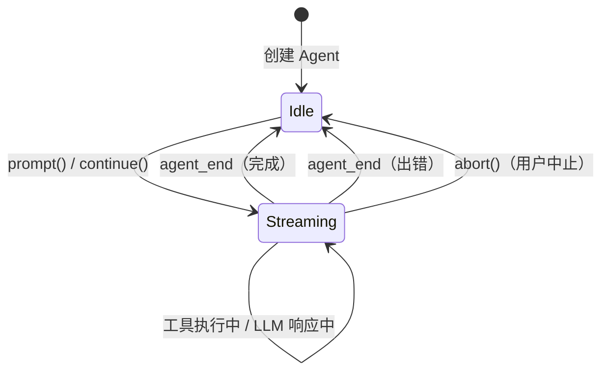

# 第 3 章：pi-agent-core —— Agent 运行时引擎

> [上一章](ch02-pi-ai.md)我们了解了 pi-ai 如何统一 20+ 家 LLM 的调用接口。但"调用 LLM"只是基础——LLM 返回一个工具调用后，谁来执行工具？谁来把结果发回给 LLM？谁来决定什么时候停止？这些问题的答案就在 pi-agent-core 中。

---

## 从"聊天"到"自主行动"

用 pi-ai 直接调用 LLM，你得到的是一个"聊天"体验——你发一条消息，LLM 回一条消息。如果 LLM 说"我要调用 read 工具"，你需要自己写代码去执行工具、把结果拼回消息历史、再次调用 LLM。

pi-agent-core 把这个循环自动化了。它在 pi-ai 之上加了三个能力：

| 能力 | 说明 |
|------|------|
| **自动执行循环** | LLM 返回工具调用 → 自动执行 → 把结果发回 LLM → 重复，直到 LLM 认为完成 |
| **事件驱动** | 循环中的每一步都产生事件，上层可以监听并实时响应（比如在 TUI 中逐字显示） |
| **运行时控制** | 支持中止、转向（Steering）、追问（Follow-up），让用户能干预正在运行的 Agent |

整个包只有约 1,900 行代码，分布在三个文件中：

| 文件 | 职责 | 行数 |
|------|------|------|
| `types.ts` | 类型定义（AgentState, AgentTool, AgentEvent 等） | ~310 |
| `agent-loop.ts` | 核心执行循环（两层循环 + 工具执行） | ~620 |
| `agent.ts` | Agent 类（状态机封装 + 公共 API） | ~610 |

---

## Agent 类：上层使用的入口

Agent 类是 pi-agent-core 的公共入口。它的设计理念是**状态机 + 事件发射器**：



**关键状态字段（AgentState）：**

| 字段 | 类型 | 说明 |
|------|------|------|
| `systemPrompt` | `string` | 当前系统提示 |
| `model` | `Model` | 当前 LLM 模型 |
| `thinkingLevel` | `ThinkingLevel` | 推理深度（off / minimal / low / medium / high / xhigh） |
| `tools` | `AgentTool[]` | 当前可用的工具列表 |
| `messages` | `AgentMessage[]` | 完整消息历史 |
| `isStreaming` | `boolean` | 是否正在执行（true = 忙碌） |
| `streamMessage` | `AgentMessage \| null` | 流式响应中的部分消息（实时更新） |
| `pendingToolCalls` | `Set<string>` | 正在执行的工具 ID 集合 |

### 核心方法

**发起对话：**
- `agent.prompt(text)` —— 发送用户消息，Agent 自动进入执行循环
- `agent.prompt(agentMessage)` —— 发送预构建的消息
- `agent.continue()` —— 从当前消息历史继续（用于重试）

**运行时干预：**
- `agent.steer(message)` —— 向正在执行的 Agent 注入高优先级消息（"停下来，改做这个"）
- `agent.followUp(message)` —— 排队一条消息，Agent 完成当前任务后自动处理
- `agent.abort()` —— 中止当前执行

**事件监听：**
- `agent.subscribe(callback)` —— 订阅事件，返回取消订阅函数

**状态修改：**
- `agent.setSystemPrompt()`, `agent.setModel()`, `agent.setTools()`, `agent.replaceMessages()` 等

### prompt() 的内部流程

当你调用 `agent.prompt("读取 src/main.ts")` 时，内部发生了什么？

**调用路径：**

```
packages/agent/src/agent.ts::prompt(input)
  — 输入："读取 src/main.ts"（字符串）
  — 检查：如果 isStreaming=true → 抛错（不能同时执行两个任务）
  — 检查：如果没有配置 model → 抛错
  — 包装为 AgentMessage：
    { role: "user", content: [{ type: "text", text: "读取 src/main.ts" }], timestamp: Date.now() }
  — 调用内部 _runLoop([userMessage])
    — 设置 isStreaming = true
    — 构建 AgentContext：{ systemPrompt, messages（克隆）, tools }
    — 构建 AgentLoopConfig：{ model, convertToLlm, getSteeringMessages, ... }
    — 调用 runAgentLoop(messages, context, config, emit, signal, streamFn)
    — 等待循环完成
    — 设置 isStreaming = false
```

从 `runAgentLoop` 开始，控制权交给了核心执行循环——整个包最关键的部分。

---

## 核心执行循环：两层循环详解

这是 pi-agent-core 的心脏。[第 1 章](ch01-data-flow.md)我们已经看到了它的流程图，这里我们深入它的每一个决策节点。

### 为什么是两层循环？

单层循环只能处理"工具调用 → 结果 → 再次调用"的简单场景。但实际使用中还有两种需求：

1. **转向（Steering）**：Agent 正在执行一个很长的任务，用户想说"停，换个方向"。转向消息需要在当前 Turn 结束后立刻注入，优先于下一次 LLM 调用。
2. **追问（Follow-up）**：Agent 完成了任务，但上层代码想自动追加一个请求（比如"完成后请生成测试"）。追问消息在 Agent 本来要停止时注入。

两层循环的设计：
- **内层循环**：处理工具调用和转向消息——只要还有工具要执行或者有转向消息，就继续循环
- **外层循环**：处理追问消息——内层循环结束后，检查是否有追问消息，有则把追问注入内层继续

### 逐步拆解

**调用路径（核心逻辑）：**

```
packages/agent/src/agent-loop.ts::runAgentLoop(prompts, context, config, emit, signal)
  — 输入：用户消息数组 + AgentContext + AgentLoopConfig + 事件回调 + 中止信号
  — 发出 agent_start 事件
  — 发出 turn_start 事件
  — 将用户消息添加到 context.messages，为每条发出 message_start + message_end
→ runLoop(context, newMessages, config, signal, emit)
  — 初始化：firstTurn = true，pendingMessages = getSteeringMessages() 或 []

  — 【外层循环】while(true)：
    — hasMoreToolCalls = true

    — 【内层循环】while(hasMoreToolCalls || pendingMessages.length > 0)：

      — (1) 发出 turn_start（非首轮）

      — (2) 如果有 pendingMessages：
            — 为每条发出 message_start + message_end
            — 追加到 context.messages
            — 清空 pendingMessages

      — (3) 调用 streamAssistantResponse()：
            — transformContext()（可选：裁剪消息）
            — convertToLlm()（AgentMessage[] → Message[]）
            — 调用 streamFn（默认 streamSimple）获取 LLM 响应
            — 逐事件推送：message_start → message_update(每个delta) → message_end
            — 返回完整的 AssistantMessage

      — (4) 如果 stopReason 是 "error" 或 "aborted"：
            — 发出 turn_end + agent_end → 退出

      — (5) 提取 ToolCall[]（从 AssistantMessage.content 中过滤 type="toolCall"）
      — hasMoreToolCalls = toolCalls.length > 0

      — (6) 如果有工具调用：
            → executeToolCalls(toolCalls, context, config, ...)
              — 对每个 ToolCall：
                — 在 context.tools 中查找匹配的工具
                — 校验参数（JSON Schema + AJV）
                — 调用 beforeToolCall()（扩展可拦截）
                — 如果被阻止 → 生成错误 ToolResult
                — 调用 tool.execute(id, args, signal, onUpdate)
                — 调用 afterToolCall()（扩展可修改结果）
                — 构建 ToolResultMessage
              — 并行或串行执行（取决于 config.toolExecution）
            — 将 ToolResultMessage[] 追加到 context.messages

      — (7) 发出 turn_end

      — (8) pendingMessages = getSteeringMessages()
      — 回到内层循环判断条件

    — 【内层循环结束】

    — (9) followUpMessages = getFollowUpMessages()
    — 如果有追问 → pendingMessages = followUpMessages，continue 外层循环
    — 否则 → break

  — 【外层循环结束】
  — 发出 agent_end
```

### 转向与追问的优先级

这里有一个精妙的优先级设计：

```
工具调用（最高优先级）→ 转向消息（中间优先级）→ 追问消息（最低优先级）
```

- **工具调用在执行中时**：转向消息被缓存，等当前 Turn 的工具全部执行完后再处理
- **内层循环检查转向消息**：每个 Turn 结束后立刻检查——如果用户在工具执行期间发了转向消息，下一轮 LLM 调用会看到它
- **追问消息只在内层循环结束后检查**：确保所有工具调用和转向消息都处理完了，Agent 真的要停下来时才看追问

这个设计让用户的实时干预（转向）能快速生效，而自动化的追问（Follow-up）不会打断正在进行的工具链。

---

## 工具执行的细节

### AgentTool 的结构

每个工具需要提供：

| 字段 | 说明 |
|------|------|
| `name` | 工具名（LLM 用这个名字调用） |
| `description` | 工具描述（帮助 LLM 理解何时使用） |
| `parameters` | TypeBox Schema（参数的类型定义 + JSON Schema） |
| `label` | 人类可读标签（显示在 UI 中） |
| `execute` | 执行函数（接收参数，返回结果） |

`execute` 函数签名中有两个重要参数：
- `signal: AbortSignal` —— 允许上层中止正在执行的工具（比如用户按了 Ctrl+C）
- `onUpdate: callback` —— 允许工具在执行过程中推送进度更新（比如 bash 命令的实时输出）

### 并行 vs 串行执行

当 LLM 一次返回多个工具调用时（比如"同时读取 a.ts 和 b.ts"），Agent 可以选择：

| 模式 | 行为 | 适用场景 |
|------|------|---------|
| `"parallel"` | 预检查（beforeToolCall）按顺序执行，工具本身并发执行，最后按原始顺序整理结果 | 独立工具（如同时读取多个文件） |
| `"sequential"` | 全部按顺序一个一个执行 | 有副作用依赖的工具（如先创建文件再读取） |

并行模式的巧妙之处：预检查（beforeToolCall）保持串行——因为扩展可能需要根据前一个工具的检查结果决定是否阻止后一个工具。但工具实际执行是并发的，充分利用 I/O 等待时间。

### beforeToolCall 与 afterToolCall

这两个钩子让上层（特别是扩展系统）能在工具执行的前后介入：

**beforeToolCall 可以：**
- 返回 `{ block: true, reason: "..." }` 阻止工具执行（Agent 会收到一条错误结果并自行决定下一步）
- 返回 `undefined` 允许执行

**afterToolCall 可以：**
- 修改工具返回的内容（`content`）
- 修改元数据（`details`）
- 改变错误状态（`isError`）
- 返回 `undefined` 保持原样

---

## 事件系统

Agent 循环中的每一步都产生事件。事件是 Agent 和外部世界通信的唯一渠道——TUI 靠事件知道什么时候显示新文字，AgentSession 靠事件知道什么时候保存消息。

### 事件生命周期

一次完整的 Agent 执行产生这样的事件序列：

```mermaid
sequenceDiagram
    participant Loop as Agent 循环
    participant Sub as 事件订阅者

    Loop->>Sub: agent_start
    Loop->>Sub: turn_start
    Loop->>Sub: message_start (UserMessage)
    Loop->>Sub: message_end (UserMessage)
    Loop->>Sub: message_start (AssistantMessage 开始流式)
    Loop->>Sub: message_update (text_delta)
    Loop->>Sub: message_update (text_delta)
    Loop->>Sub: message_update (toolcall_end)
    Loop->>Sub: message_end (AssistantMessage 完成)
    Loop->>Sub: tool_execution_start (read)
    Loop->>Sub: tool_execution_end (read, 结果)
    Loop->>Sub: message_start (ToolResultMessage)
    Loop->>Sub: message_end (ToolResultMessage)
    Loop->>Sub: turn_end
    Loop->>Sub: turn_start
    Loop->>Sub: message_start (AssistantMessage 第二次)
    Loop->>Sub: message_update (text_delta ...)
    Loop->>Sub: message_end (AssistantMessage 完成)
    Loop->>Sub: turn_end
    Loop->>Sub: agent_end
```

### 事件层级

事件分为三个层级：

| 层级 | 事件 | 含义 |
|------|------|------|
| **Agent 级** | `agent_start` / `agent_end` | 整个执行的开始和结束 |
| **Turn 级** | `turn_start` / `turn_end` | 一次"LLM 响应 + 工具执行"周期 |
| **消息/工具级** | `message_start/update/end`、`tool_execution_start/update/end` | 单条消息或单个工具的生命周期 |

`message_update` 事件中嵌套了来自 pi-ai 的 `AssistantMessageEvent`——也就是说，上层既可以监听粗粒度的 Agent 事件（"这个 Turn 结束了"），也可以监听细粒度的流式事件（"又来了一个 text_delta"）。

### Agent 类的事件处理

Agent 类在收到循环事件后，除了转发给外部订阅者，还会**同步更新自身状态**：

| 事件 | 状态更新 |
|------|---------|
| `message_start`（Assistant） | `state.streamMessage = message`（开始追踪流式消息） |
| `message_update` | 更新 `state.streamMessage` 的内容 |
| `message_end`（Assistant） | `state.messages.push(message)`，`state.streamMessage = null` |
| `tool_execution_start` | `state.pendingToolCalls.add(toolCallId)` |
| `tool_execution_end` | `state.pendingToolCalls.delete(toolCallId)` |
| `agent_end` | `state.isStreaming = false` |

这确保了在任何时刻，`agent.state` 都反映最新状态——上层可以随时读取。

---

## 消息转换：AgentMessage 到 Message

Agent 层使用 `AgentMessage` 类型，LLM 层使用 `Message` 类型。两者的核心差异：

- `AgentMessage` 可以通过 TypeScript 的 declaration merging 扩展自定义类型（coding-agent 就扩展了 `CompactionMessage` 等自定义类型）
- `Message` 是 LLM 能理解的三种标准类型（User / Assistant / ToolResult）

`convertToLlm` 函数负责这个转换。默认实现很简单：直接过滤掉不属于 User / Assistant / ToolResult 的自定义消息。coding-agent 会提供更复杂的实现，比如把压缩摘要消息转换成用户消息。

`transformContext` 则是一个可选的预处理步骤——coding-agent 用它来在上下文窗口快满时裁剪旧消息。

---

## 小结

pi-agent-core 用不到 2,000 行代码实现了一个完整的 Agent 运行时：

| 组件 | 职责 |
|------|------|
| **Agent 类** | 状态机入口——管理状态、分发事件、提供公共 API |
| **两层循环** | 核心引擎——自动化工具调用、处理转向和追问 |
| **工具执行** | 参数校验、前后钩子、并行/串行控制 |
| **事件系统** | 细粒度的执行过程通知 |

它故意保持小而专注：不关心工具具体做什么（那是 coding-agent 的事），不关心怎么持久化（那也是 coding-agent 的事），不关心怎么渲染（那是 TUI 的事）。它只负责一件事：**让 LLM 和工具高效地循环协作**。

有了 pi-ai（LLM 调用）和 pi-agent-core（执行循环）这两块基石，[第 4 章](ch04-coding-agent.md)将展示 coding-agent 如何在它们之上构建一个功能完整的编程 Agent——从命令行入口到会话编排，从工具注册到扩展加载。

---

### 质检报告

**讲解节奏**
- [x] 先讲"从聊天到自主行动"的需求，再讲具体实现
- [x] Agent 类先讲"它是什么"（状态机），再讲内部方法

**周边知识**
- [x] 解释了为什么需要两层循环（转向和追问的需求）
- [x] 解释了并行执行中预检查串行的原因

**讲透了吗**
- [x] 两层循环的 9 个步骤逐一拆解
- [x] 转向/追问的优先级关系讲清
- [x] 事件系统的三个层级 + 状态同步逻辑
- [x] 没有跳步

**代码纪律**
- [x] 全章代码片段 0 处
- [x] 全部使用调用路径、表格和图表表达

**流程图准确性**
- [x] 状态图基于 agent.ts 的 isStreaming 状态转换确认
- [x] 事件序列图基于 agent-loop.ts 的 emit 调用确认
- [x] 两层循环描述基于 runLoop() 源码确认

**过渡自然吗**
- [x] 章头衔接第 2 章（"pi-ai 统一了 LLM 调用，但谁来执行工具？"）
- [x] 章尾引出第 4 章（"coding-agent 如何在此基础上构建完整编程 Agent"）
- [x] 各节以"需求 → 解决方案"衔接

**准确吗**
- [x] 代码行数 (~1900) 经 wc -l 确认
- [x] 三个文件的职责经源码确认
- [x] 事件类型名称经 types.ts 确认

**读得下去吗**
- [x] 状态机概念配合状态图直观展示
- [x] 事件序列用时序图可视化
- [x] 每张图有文字讲解

**勘误建议**
- 无
