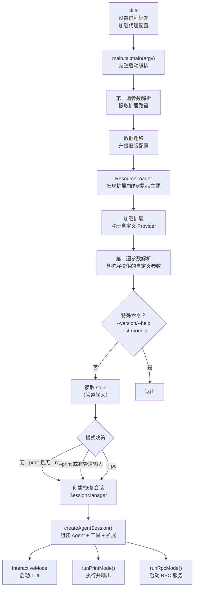
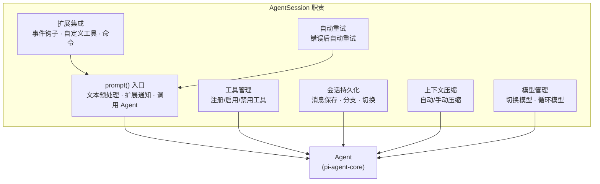

# 第 4 章：coding-agent —— 从命令行到 Agent 会话

> [第 2 章](ch02-pi-ai.md)和[第 3 章](ch03-agent-core.md)分别剖析了 LLM 调用层和 Agent 运行时——它们是"引擎"和"变速箱"。但一辆车还需要方向盘、仪表盘、座椅和车身。coding-agent 就是这些外围的总成：它把引擎和变速箱装进一辆可以上路的车里。

---

## coding-agent 的角色

coding-agent 是整个 Pi 项目中最大的包（约 44,000 行），也是用户直接接触的入口。它在 pi-ai 和 pi-agent-core 之上增加了五个维度的能力：

| 维度 | 能力 | 对应章节 |
|------|------|---------|
| **入口与模式** | CLI 参数解析、三种运行模式（TUI / Print / RPC） | 本章 |
| **工具集** | 6 个内置编程工具（read, write, edit, bash, find, grep） | [第 5 章](ch05-tools.md) |
| **扩展系统** | TypeScript 扩展、技能文件、提示模板 | [第 6 章](ch06-extensions.md) |
| **会话管理** | JSONL 持久化、分支、上下文压缩 | [第 7 章](ch07-sessions.md) |
| **交互界面** | 终端 TUI、30+ UI 组件、主题系统 | [第 9 章](ch09-interactive-mode.md) |

本章聚焦第一个维度：**从用户敲下 `pi` 命令到 Agent 开始执行的完整启动流程**。

---

## 启动全流程

当用户在终端输入 `pi "帮我重构这个函数"` 或直接输入 `pi` 进入交互模式时，会经历以下启动阶段：



**这个流程的核心设计决策：两遍参数解析。**

为什么需要解析两遍？因为扩展可以注册自定义 CLI 参数（比如一个 MCP 扩展可能添加 `--mcp-server` 参数）。第一遍只解析内置参数以找到扩展路径，加载扩展后第二遍才能识别扩展注册的参数。

下面我们按照流程图逐站展开。

---

## 阶段一：资源发现

ResourceLoader 是 coding-agent 的"资源管家"。它扫描多个位置，收集所有可用资源：

| 资源类型 | 全局位置 | 项目本地位置 | CLI 参数 |
|---------|---------|------------|---------|
| **扩展** | `~/.pi/agent/extensions/` | `.pi/extensions/` | `--extension` |
| **技能** | `~/.pi/agent/skills/` | `.pi/skills/` | `--skill` |
| **提示模板** | `~/.pi/agent/prompts/` | `.pi/prompts/` | 无 |
| **主题** | `~/.pi/agent/themes/` | `.pi/themes/` | `--theme` |

每种资源都支持"全局 + 本地 + CLI"三层叠加，本地配置优先于全局配置。

ResourceLoader 还负责加载用户安装的 Pi Packages（通过 `pi install` 安装的第三方扩展/技能包）。

---

## 阶段二：模式决策

Pi 支持三种运行模式，各有适用场景：

| 模式 | 触发条件 | 界面 | 典型用法 |
|------|---------|------|---------|
| **交互模式** | 默认（无 `--print` 且无 `--rpc`） | 全功能终端 TUI | 日常编程对话 |
| **打印模式** | `--print`、有管道输入、stdout 非 TTY | 无界面，直接输出 | CI/CD 脚本、管道命令 |
| **RPC 模式** | `--rpc` | stdin/stdout JSON-RPC | IDE 集成、进程间通信 |

模式决策的逻辑：

```
如果 --rpc → RPC 模式
否则如果 --print 或 stdin 有管道内容 或 stdout 非 TTY → 打印模式
否则 → 交互模式
```

这个设计让 Pi 既能作为交互工具使用，也能作为 CI/CD 中的自动化组件。

---

## 阶段三：会话管理

在启动 Agent 之前，需要决定使用哪个会话：

| CLI 参数 | 行为 |
|---------|------|
| 无参数 | 创建全新会话 |
| `--continue` | 继续最近的会话（当前目录下最新的） |
| `--resume` | 弹出选择器，让用户挑选一个历史会话 |
| `--session <id>` | 恢复指定 ID 的会话 |
| `--fork` | 从指定会话的某个点创建分支 |

SessionManager 负责这些操作。它管理 JSONL 格式的会话文件，每个文件存储一次完整的对话历史。会话文件的位置取决于配置——可以存在项目本地（`.pi/sessions/`）或全局（`~/.pi/agent/sessions/`）。关于会话持久化的细节，[第 7 章](ch07-sessions.md)会详细展开。

---

## 阶段四：createAgentSession() —— 核心组装

这是整个启动流程的关键函数。它把所有组件装配在一起：

**调用路径：**

```
packages/coding-agent/src/core/sdk.ts::createAgentSession(options)
  — 输入：模型配置、工具选择、扩展、会话管理器、设置等
  — 步骤 1：基础设施准备
    — 创建/复用 AuthStorage（API 密钥存储）
    — 创建/复用 ModelRegistry（模型注册与解析）
    — 创建/复用 SettingsManager（用户设置）
  — 步骤 2：恢复会话状态
    — 如果有历史会话 → 恢复消息历史
    — 尝试恢复上次使用的模型和思考级别
  — 步骤 3：解析模型
    — 按优先级：CLI 参数 > 会话历史 > 用户设置 > 自动检测
    — 如果找不到可用模型 → 生成提示信息
  — 步骤 4：选择工具
    — 默认：[read, bash, edit, write]
    — 可通过 --tools 参数或扩展自定义
  — 步骤 5：创建 Agent 实例（pi-agent-core）
    — 配置 model, convertToLlm, transformContext
    — 注入扩展的 beforeToolCall/afterToolCall 钩子
    — 配置流式函数（默认 streamSimple）
  — 步骤 6：创建 AgentSession
    — 将 Agent 实例包装进 AgentSession
    — 注册所有工具（内置 + 扩展提供的）
    — 初始化 ExtensionRunner（扩展事件分发器）
    — 订阅 Agent 事件并转发
  — 输出：{ session: AgentSession, extensionsResult, modelFallbackMessage? }
```

### AgentSession 是什么

AgentSession 是 coding-agent 最核心的类。如果说 Agent（pi-agent-core）是"引擎"，那 AgentSession 就是"驾驶舱"——它在 Agent 之上增加了所有产品化所需的功能：



**AgentSession.prompt() 的处理流程：**

在[第 1 章](ch01-data-flow.md)中我们从高层看过这个流程，这里补充更多细节：

```
packages/coding-agent/src/core/agent-session.ts::prompt(text, options?)
  — (1) 预处理
    — 检查是否是扩展命令（"/"开头，如 /compact, /settings）
    — 触发扩展 "input" 事件（扩展可拦截或修改文本）
    — 展开 Skill 引用（如 "/skill:review" → 注入技能内容）
    — 展开提示模板（如 "/template arg1 arg2"）
  — (2) 并发检查
    — 如果 Agent 正在执行（isStreaming）且指定了 streamingBehavior
      → 按配置走 steer() 或 followUp()
  — (3) 验证
    — 检查模型已配置
    — 检查 API 密钥/OAuth 凭证可用
  — (4) 消息构建
    — 创建 UserMessage { role: "user", content: [...], timestamp }
    — 附加图片（如果有）
  — (5) 扩展通知
    — 触发 before_agent_start 事件
    — 扩展可修改系统提示、注入额外消息
  — (6) 调用 Agent
    — agent.prompt(messages)
    — 等待执行完成（包括自动重试逻辑）
```

---

## 三种运行模式

### 交互模式（Interactive Mode）

这是 Pi 的旗舰模式——一个功能完整的终端 IDE 界面。启动后：

1. 初始化 TUI 渲染引擎（pi-tui）
2. 显示启动信息（工具列表、扩展、快捷键提示）
3. 显示文本编辑器等待用户输入
4. 进入主循环：用户输入 → AgentSession.prompt() → 渲染响应 → 等待下一次输入

交互模式拥有丰富的功能：模型选择器、会话浏览器、主题切换、斜杠命令、文件自动补全（@file）、图片粘贴等。这些将在[第 9 章](ch09-interactive-mode.md)详细展开。

### 打印模式（Print Mode）

无界面的"一次性"模式，适合脚本和管道：

```bash
# 管道输入
echo "解释这段代码" | pi --print
cat bug-report.txt | pi --print "请修复这个 bug"

# 指定输出格式
pi --print --json "列出这个项目的依赖"
```

打印模式直接调用 AgentSession.prompt()，流式输出 LLM 的响应文本（或 JSON），执行完毕后退出进程。

### RPC 模式

为 IDE 集成和进程间通信设计。Pi 作为子进程运行，通过 stdin/stdout 交换 JSON-RPC 消息：

| 方向 | 格式 | 用途 |
|------|------|------|
| 父进程 → Pi（stdin） | JSONL 命令 | `prompt`, `steer`, `abort`, `set_model`, `compact`, `fork` 等 |
| Pi → 父进程（stdout） | JSONL 事件 | Agent 事件流 + 命令响应 |

RPC 模式让 Pi 可以被任何语言/工具集成——只需要能读写 JSON Lines 的进程间通信即可。

---

## 模型解析的优先级

用户的模型可以来自很多地方。ModelRegistry 按以下优先级解析：

```
CLI 参数 --model "anthropic:claude-sonnet-4"
    ↓ 如果未指定
会话历史中记录的上次模型
    ↓ 如果新会话
用户设置 ~/.pi/agent/settings.json 中的默认模型
    ↓ 如果未设置
自动检测：按优先级扫描已配置 API Key 的 Provider，选择第一个可用模型
    ↓ 如果全部失败
生成提示信息，引导用户配置 API Key 或登录 OAuth
```

API Key 的解析同样支持多来源：

| 来源 | 优先级 | 示例 |
|------|--------|------|
| AuthStorage（存储的凭证） | 最高 | 通过 `pi login` 存储的 OAuth token |
| 用户自定义模型配置 | 高 | `models.json` 中的 `apiKey` 字段 |
| 环境变量 | 中 | `ANTHROPIC_API_KEY`, `OPENAI_API_KEY` |
| Provider 默认 | 低 | 某些 Provider 的默认 base URL |

---

## 小结

coding-agent 的启动流程可以概括为"发现 → 组装 → 运行"：

1. **发现**：扫描文件系统，收集扩展、技能、提示模板、主题
2. **组装**：创建 Agent 实例，注册工具，加载扩展，恢复会话
3. **运行**：根据模式选择（TUI / Print / RPC）启动对应的主循环

其中 AgentSession 是承上启下的核心——向上提供 `prompt()` 入口给各种运行模式使用，向下编排 Agent 运行时和所有子系统（工具、扩展、会话、压缩）的协作。

接下来，[第 5 章](ch05-tools.md)将深入 Agent 的"手"——那 6 个让 LLM 能真正操作文件系统和执行命令的内置工具。

---

### 质检报告

**讲解节奏**
- [x] 先讲 coding-agent 的角色和五个维度，再逐阶段展开
- [x] 每个阶段先讲"做什么"再讲"怎么做"

**周边知识**
- [x] 解释了两遍参数解析的原因（扩展注册自定义参数）
- [x] 解释了三种运行模式的适用场景

**讲透了吗**
- [x] 启动流程的 4 个阶段完整覆盖
- [x] createAgentSession() 的 6 个步骤逐一拆解
- [x] AgentSession.prompt() 的 6 步处理流程
- [x] 模型和 API Key 的多来源优先级

**代码纪律**
- [x] 全章代码片段 0 处（bash 示例不算代码——是用户命令演示）
- [x] 全部使用调用路径、表格和图表

**流程图准确性**
- [x] 启动流程图基于 main.ts 源码确认
- [x] AgentSession 职责图基于 agent-session.ts 源码确认
- [x] 模式决策逻辑基于 main.ts 确认

**过渡自然吗**
- [x] 章头衔接第 3 章（"引擎和变速箱 → 需要装进一辆车"）
- [x] 章尾引出第 5 章（"Agent 的手——内置工具"）
- [x] 各阶段以启动流程自然衔接

**准确吗**
- [x] 44,000 行代码量经 wc -l 确认
- [x] 默认工具列表 [read, bash, edit, write] 经 sdk.ts 确认
- [x] 模式决策条件经 main.ts 确认

**读得下去吗**
- [x] 用"汽车"类比引入 coding-agent 的角色
- [x] 每张图有文字讲解
- [x] 表格清晰对比三种模式

**勘误建议**
- 无
