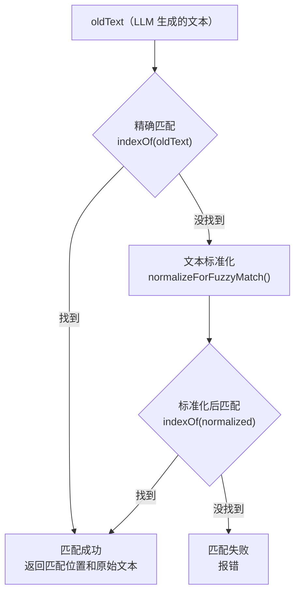

# 第 5 章：工具系统 —— Agent 的"手"

> [第 3 章](ch03-agent-core.md)讲了 Agent 运行时如何自动化工具调用循环，[第 4 章](ch04-coding-agent.md)讲了 coding-agent 如何组装一切。但我们一直把工具当作黑盒——"执行 read 工具，返回文件内容"。这一章，我们打开这些黑盒，看看 Pi 的 6 个内置工具是怎样让 LLM 真正操作文件系统的。

---

## 工具设计的核心挑战

让 LLM 操作文件系统，面临三个工程挑战：

1. **输出截断**：一个文件可能有几万行，LLM 的上下文窗口装不下。工具需要智能截断，同时告诉 LLM"后面还有更多，用 offset 参数继续读"。
2. **模糊匹配**：LLM 生成的代码片段可能与文件中的原文有微小差异——智能引号变了、空格多了一个。edit 工具需要容忍这些差异。
3. **安全控制**：bash 命令可能永远不返回、可能产生巨量输出。工具需要超时机制和输出上限。

每个工具的实现都围绕这些挑战展开。

---

## 工具一览

| 工具 | 用途 | 核心难点 |
|------|------|---------|
| **read** | 读取文件内容 | 大文件截断、图片检测 |
| **write** | 创建或覆写文件 | 目录自动创建 |
| **edit** | 在文件中精确替换文本 | 模糊匹配、多处编辑、行尾处理 |
| **bash** | 执行 Shell 命令 | 输出捕获、超时、进程树清理 |
| **find** | 按模式搜索文件名 | 尊重 .gitignore、结果截断 |
| **grep** | 按模式搜索文件内容 | 上下文行、长行截断 |

下面按复杂度从低到高逐个展开。

---

## read：文件读取

read 是最常用的工具——几乎每次交互 LLM 都会先读文件了解情况。

**参数：**

| 参数 | 类型 | 说明 |
|------|------|------|
| `path` | string | 文件路径（相对或绝对） |
| `offset` | number（可选） | 起始行号（1-indexed） |
| `limit` | number（可选） | 最大读取行数 |

**执行流程：**

```
read.execute({ path: "src/main.ts", offset: 100, limit: 50 })
  — 解析路径：相对 → 绝对（基于工作目录）
  — 检查文件权限
  — 检测文件类型
    → 如果是图片（jpg/png/gif/webp）：
      — 读取为 base64
      — 可选自动缩放（减少 token 消耗）
      — 返回 ImageContent
    → 如果是文本文件：
      — 读取完整内容（UTF-8）
      — 应用 offset 和 limit（跳过前 99 行，取 50 行）
      — 应用截断（最多 500 行或 512KB）
      — 如果被截断 → 在返回文本末尾提示"用 offset=N 继续读取"
      — 返回 TextContent
```

**截断策略（头部截断）：** read 使用 `truncateHead()` —— 保留文件开头（或 offset 之后的开头），这是因为读者通常想从头看。截断发生时，返回文本会包含一行提示："[超出 500 行限制，已截断，用 offset=501 继续读取]"。LLM 看到这个提示后，会自动发起第二次 read 调用。

---

## write：文件写入

write 是最简单的工具——直接覆写文件内容。

**参数：**

| 参数 | 类型 | 说明 |
|------|------|------|
| `path` | string | 文件路径 |
| `content` | string | 要写入的内容 |

**执行流程：**

```
write.execute({ path: "src/new-file.ts", content: "export function hello() { ... }" })
  — 解析路径：相对 → 绝对
  — 创建父目录（如果不存在，递归创建）
  — 写入文件（覆写模式，UTF-8）
  — 返回确认消息（文件路径 + 字节数）
```

write 永远是完整覆写，不支持追加模式。如果 LLM 想在现有文件中修改部分内容，它应该用 edit 工具。

---

## edit：精确文本替换

edit 是技术上最复杂的工具。LLM 指定"把文件中的 A 替换成 B"，edit 需要在文件中找到 A 并替换。难点在于：LLM 生成的 A 和文件中的实际文本可能有微小差异。

**参数（两种模式）：**

| 模式 | 参数 | 说明 |
|------|------|------|
| **单次替换** | `path`, `oldText`, `newText` | 替换一处 |
| **多次替换** | `path`, `edits: [{oldText, newText}, ...]` | 替换多处不重叠的位置 |

### 执行流程

```
edit.execute({ path: "src/main.ts", oldText: "const x = 1", newText: "const x = 2" })
  — 解析路径
  — 进入文件变更队列（防止并发修改同一文件）
  — 读取文件内容
  — 检测行尾格式（CRLF 或 LF）
  — 统一转为 LF 进行处理
  — 对每个 {oldText, newText}：
    → 精确匹配（indexOf）
    → 如果精确匹配失败 → 模糊匹配
    → 如果模糊匹配也失败 → 报错
  — 检查所有匹配位置不重叠
  — 按位置从后往前替换（保持偏移量稳定）
  — 恢复原始行尾格式
  — 写入文件
  — 生成 unified diff 返回给 LLM
```

### 模糊匹配的工作原理

当精确匹配失败时，edit-diff.ts 的 `fuzzyFindText()` 启动模糊匹配管道：



`normalizeForFuzzyMatch()` 做了 5 种标准化：

| 标准化 | 处理 | 解决的问题 |
|--------|------|-----------|
| Unicode NFKC | 统一等价字符（如全角/半角） | LLM 可能混用全角半角字符 |
| 行尾空白 | 去除每行末尾空格 | LLM 常常丢失或添加尾部空格 |
| 智能引号 | `'` `'` `"` `"` → `'` `"` | 某些 Provider 返回智能引号 |
| Unicode 破折号 | 各种破折号 → ASCII `-` | LLM 混用不同破折号 |
| Unicode 空格 | 不间断空格等 → 普通空格 | 格式化产生的特殊空格 |

对文件内容和 oldText 都做同样的标准化后再匹配。如果标准化后能匹配到，就用原始文件中对应位置的**原始文本**进行替换——这样保留了文件的原始格式。

### 多处编辑的安全检查

当 LLM 要求一次替换多处时，edit 工具会：
1. 先匹配所有 oldText 的位置
2. 检查没有重叠（两个 oldText 不能覆盖同一段内容）
3. 按位置**从后往前**替换——这样前面的替换不会影响后面的偏移量

---

## bash：命令执行

bash 是 LLM 最强大也最危险的工具——它可以执行任意 Shell 命令。

**参数：**

| 参数 | 类型 | 说明 |
|------|------|------|
| `command` | string | Bash 命令 |
| `timeout` | number（可选） | 超时秒数 |

### 输出捕获策略

bash 命令的输出可能非常大（比如 `find /`）。Pi 使用**滚动缓冲区**策略：

```
命令开始执行
  ↓
stdout/stderr 数据到达
  ↓
追加到内存缓冲区（最近的 chunks）
  ↓
定期通过 onUpdate() 推送给 TUI（实时显示）
  ↓
命令结束
  ↓
合并所有 chunks → 应用尾部截断（truncateTail）
  ↓
如果被截断 → 完整输出保存到临时文件，路径包含在返回信息中
  ↓
返回截断后的输出
```

**尾部截断（truncateTail）**：bash 使用尾部截断而非头部——因为命令输出的最后部分通常包含错误信息和最终结果，比开头更有价值。默认限制是 2,000 行或 50KB。

### 超时与进程管理

```
命令启动
  ↓
设置定时器（timeout 秒后触发）
  ↓ 如果超时
发送 SIGTERM 给进程树（整个进程组）
  ↓ 等待优雅退出
如果仍未退出 → 发送 SIGKILL 强制终止
  ↓
返回错误："timeout: 命令在 N 秒后超时"
```

注意是**进程树**而非单个进程——如果 bash 命令启动了子进程（比如 `npm install` 启动了 node），所有子进程都会被一起终止。

用户按中止（Ctrl+C / abort）时走同样的流程：先 SIGTERM，再 SIGKILL。

---

## find 和 grep：文件搜索

这两个工具帮 LLM 在项目中定位信息。

### find：文件名搜索

底层使用 `fd` 工具（一个高性能的 find 替代品，如果未安装会自动下载）：
- 支持 glob 模式（`*.ts`, `**/*.json`）
- 自动尊重 `.gitignore`（不搜索被忽略的文件）
- 默认排除 `node_modules` 和 `.git`
- 结果限制：最多 1,000 条或 50KB

### grep：内容搜索

底层使用 `ripgrep`（rg）的 JSON 输出模式：
- 支持正则表达式和字面字符串
- 支持 glob 过滤（只搜索 `*.py` 文件）
- 支持上下文行（匹配行前后各 N 行）
- 长行截断：单行超过 500 字符自动截断
- 结果限制：最多 100 条匹配或 50KB

---

## 截断系统：统一的输出管理

所有工具都面临一个共同问题：输出可能太大，塞不进 LLM 的上下文窗口。Pi 用 `truncate.ts` 提供三种截断策略：

| 策略 | 适用工具 | 保留部分 | 原因 |
|------|---------|---------|------|
| **头部截断**（truncateHead） | read, find | 保留开头 | 读者想从头看 |
| **尾部截断**（truncateTail） | bash | 保留结尾 | 错误和结果在最后 |
| **行内截断**（truncateLine） | grep | 保留行头 | 长行的关键信息在前面 |

每种截断都返回详细的 `TruncationResult`——包含总行数、输出行数、是否被截断、截断原因。这些信息帮助 LLM 判断"我需不需要用不同参数再读一次"。

---

## 工具的可插拔架构

一个值得注意的设计：所有工具的文件操作（读、写、创建目录、检查权限等）都通过一个 Operations 接口抽象。默认实现直接调用 Node.js 的 `fs` 模块，但可以替换为：

- SSH 远程操作（mom 包用这个在 Docker 容器中操作文件）
- 虚拟文件系统
- 带权限检查的包装器

这意味着同一套工具定义可以在不同环境中工作——本地文件系统、远程服务器、容器内——只需切换 Operations 实现。

---

## 小结

Pi 的 6 个内置工具覆盖了编程 Agent 的核心需求：

| 需求 | 工具 | 关键技术 |
|------|------|---------|
| 了解代码 | read, grep, find | 截断 + 分页 + gitignore |
| 修改代码 | edit | 模糊匹配 + 从后往前替换 |
| 创建文件 | write | 目录自动创建 |
| 运行命令 | bash | 滚动缓冲 + 超时 + 进程树清理 |

工具是 Agent 与物理世界之间的桥梁。但如果只有这 6 个内置工具，Agent 的能力就固定了。[第 6 章](ch06-extensions.md)将展示扩展系统如何打破这个限制——让用户添加任意自定义工具，注入任意行为钩子。

---

### 质检报告

**讲解节奏**
- [x] 先讲"工具面临的核心挑战"再讲每个工具
- [x] 每个工具先讲"做什么"再讲"内部怎么做"

**周边知识**
- [x] 解释了为什么需要头部/尾部不同的截断策略
- [x] 解释了模糊匹配存在的原因（LLM 生成的文本有微小差异）
- [x] 解释了从后往前替换的原因

**讲透了吗**
- [x] edit 的模糊匹配管道完整拆解（5 种标准化）
- [x] bash 的输出捕获策略完整描述
- [x] 截断系统的三种策略对比清晰
- [x] 没有跳步

**代码纪律**
- [x] 全章代码片段 0 处
- [x] 全部使用调用路径、表格和流程图

**流程图准确性**
- [x] edit 模糊匹配流程基于 edit-diff.ts 源码确认
- [x] bash 输出捕获流程基于 bash.ts 源码确认
- [x] 截断策略基于 truncate.ts 源码确认

**过渡自然吗**
- [x] 章头衔接第 3、4 章（"一直把工具当黑盒，现在打开"）
- [x] 章尾引出第 6 章（"扩展系统打破工具数量限制"）
- [x] 工具之间按复杂度排列，自然过渡

**准确吗**
- [x] 截断限制（500行/512KB, 2000行/50KB, 500字符）经源码确认
- [x] 模糊匹配的 5 种标准化经 edit-diff.ts 确认
- [x] bash 的 SIGTERM→SIGKILL 流程经 bash.ts 确认

**读得下去吗**
- [x] 每个工具的参数用表格清晰展示
- [x] 模糊匹配用流程图可视化
- [x] 截断策略用对比表格展示

**勘误建议**
- 无
