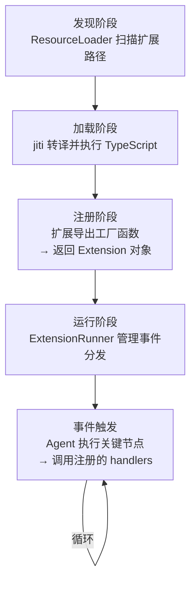
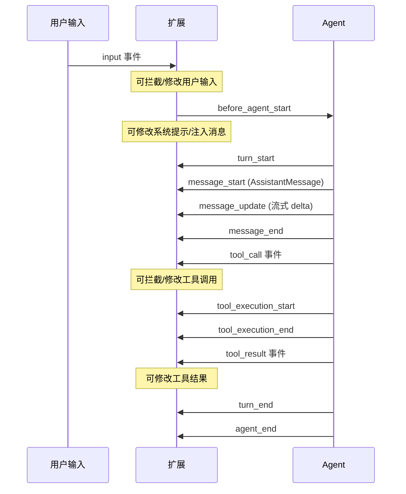

# 第 6 章：扩展系统 —— 不 Fork 就能扩展一切

> [第 5 章](ch05-tools.md)展示了 Pi 的 6 个内置工具如何让 LLM 操作文件系统。但如果你需要一个"运行 Docker 容器"工具呢？需要一个"查询数据库"工具呢？需要在每次工具调用前自动记录审计日志呢？Pi 的扩展系统让这一切成为可能——而你不需要 Fork 项目或修改任何源代码。

---

## 扩展能做什么

Pi 的扩展系统提供了四个维度的定制能力：

| 维度 | 能力 | 示例 |
|------|------|------|
| **自定义工具** | 注册新的 LLM 可调用工具 | Docker 管理、数据库查询、API 调用 |
| **事件钩子** | 在 Agent 执行的关键节点注入逻辑 | 审计日志、工具调用过滤、系统提示修改 |
| **斜杠命令** | 注册用户可触发的交互命令 | /deploy、/review、/summarize |
| **自定义 Provider** | 注册新的 LLM Provider | 私有部署的模型、自定义 API 网关 |

一个扩展就是一个 TypeScript 文件。Pi 用 jiti（一个 TypeScript 即时转译器）加载它，不需要预编译。

---

## 扩展的生命周期



**每个阶段的关键：**

### 发现

ResourceLoader 在三个位置扫描扩展文件：

| 位置 | 作用域 |
|------|--------|
| `~/.pi/agent/extensions/` | 全局（所有项目生效） |
| `.pi/extensions/` | 项目本地（仅当前项目生效） |
| `--extension` CLI 参数 | 本次会话（仅当次生效） |

此外，通过 `pi install` 安装的 Pi Packages 也会被发现。

### 加载

Pi 使用 jiti 加载扩展。jiti 的核心能力是**直接执行 TypeScript 文件**——不需要 `tsc` 编译步骤。它在运行时转译 TypeScript 为 JavaScript 并执行。

加载时，Pi 还为扩展提供了**虚拟模块**——扩展可以直接 import Pi 的核心包而不需要 npm install：

| 虚拟模块 | 映射到 |
|---------|--------|
| `@anthropic-ai/typebox` | pi-ai 内置的 TypeBox |
| `pi-agent-core` | @mariozechner/pi-agent-core |
| `pi-ai` | @mariozechner/pi-ai |
| `pi-tui` | @mariozechner/pi-tui |
| `pi-coding-agent` | @mariozechner/pi-coding-agent |

### 注册

扩展文件导出一个默认函数（工厂函数）。Pi 调用这个函数，传入 ExtensionAPI，函数返回一个 Extension 对象，其中包含事件处理器、自定义工具、斜杠命令等注册信息。

### 运行

ExtensionRunner 管理所有已加载扩展的事件分发。当 Agent 执行到某个关键节点时，ExtensionRunner 按顺序调用所有注册了该事件的处理器。

---

## 事件钩子系统

事件钩子是扩展系统最强大的能力。Agent 执行过程中的关键节点都会触发事件：

### 事件时间线



### 关键事件详解

| 事件 | 触发时机 | 扩展能做什么 |
|------|---------|------------|
| `input` | 用户输入到达，Agent 尚未启动 | 拦截输入、自动补全、验证 |
| `before_agent_start` | Agent 即将开始执行 | 修改系统提示、注入上下文消息、动态增减工具 |
| `tool_call` | LLM 请求调用工具，执行前 | 拦截并阻止特定工具调用、记录审计日志 |
| `tool_result` | 工具执行完毕，结果返回前 | 修改工具结果、添加额外信息 |
| `turn_end` | 一个 Turn 完成 | 后处理、统计、触发追问 |
| `session_before_compact` | 上下文压缩前 | 自定义压缩策略 |
| `session_before_fork` | 会话分支前 | 通知或阻止分支 |
| `before_provider_request` | LLM API 请求发出前 | 修改请求参数、添加自定义 Header |
| `resources_discover` | 资源发现阶段 | 动态注册额外的扩展路径 |

事件处理器可以返回值来影响流程。比如 `tool_call` 处理器返回 `{ block: true }` 就能阻止一个工具调用；`before_agent_start` 处理器返回修改后的系统提示就能改变 Agent 的行为。

---

## 自定义工具

扩展可以注册新工具，让 LLM 获得全新的能力。自定义工具的定义方式和内置工具完全一致：

| 要素 | 说明 |
|------|------|
| 名称 | LLM 调用时使用的标识符 |
| 描述 | 帮助 LLM 理解何时使用（出现在系统提示中） |
| 参数 Schema | TypeBox Schema，定义参数类型 |
| 执行函数 | 接收验证后的参数，返回文本/图片结果 |

自定义工具被注册后，会出现在 Agent 的工具列表中。LLM 在系统提示中看到工具描述，就知道什么时候可以调用它。执行流程与内置工具完全一致——经过[第 3 章](ch03-agent-core.md)描述的参数校验、beforeToolCall 钩子、执行、afterToolCall 钩子。

---

## 斜杠命令

除了工具（由 LLM 调用），扩展还可以注册斜杠命令（由用户调用）。用户在输入框中输入 `/commandName args` 就能触发。

斜杠命令可以：
- 弹出选择器、确认框、输入框等 UI 元素
- 直接调用 AgentSession 的方法（如 `session.prompt()`）
- 读写设置
- 操作会话（分支、切换、压缩）

内置的斜杠命令（如 `/compact`, `/settings`, `/model`, `/fork`）也是用同样的机制实现的——只不过它们内置在 coding-agent 中而非独立的扩展文件。

---

## 扩展 UI 交互

在交互模式下，扩展可以通过 ExtensionUIContext 与用户互动：

| UI 方法 | 用途 |
|---------|------|
| `select(items, options)` | 弹出选择列表 |
| `confirm(message)` | 弹出确认对话框 |
| `input(prompt)` | 弹出文本输入 |
| `widget(component)` | 在 TUI 中渲染自定义组件 |
| `overlay(component, options)` | 显示浮层 |

在 RPC 模式下，这些 UI 方法会被序列化为 JSON-RPC 请求发送给宿主进程——宿主进程负责在自己的 UI 中呈现，并把用户的选择通过 JSON-RPC 返回。这使得同一个扩展在 TUI 和 IDE 集成中都能工作。

---

## 技能（Skills）和提示模板（Prompt Templates）

除了 TypeScript 扩展，Pi 还有两种轻量级的"扩展"机制：

### 技能文件

技能文件是**纯 Markdown 文件**，放在 `~/.pi/agent/skills/` 或 `.pi/skills/` 中。它们的内容会被注入到系统提示中，让 LLM "知道"自己有这个技能。

技能文件的格式：

```
---
name: code-review
description: 专业的代码审查技能
---

你是一个代码审查专家。当用户要求审查代码时...（技能描述）
```

技能不需要代码——纯文本描述就够了。这是最简单的扩展方式。

### 提示模板

提示模板也是 Markdown 文件，放在 `~/.pi/agent/prompts/` 中。它们是可复用的提示词模板，支持参数替换：

| 变量 | 含义 |
|------|------|
| `$1`, `$2` | 第 1、2 个参数 |
| `$@` | 所有参数 |
| `${@:N:L}` | 从第 N 个参数开始取 L 个 |

用户通过 `/templateName arg1 arg2` 调用，模板会展开为完整的提示词发送给 Agent。

---

## 小结

Pi 的扩展系统在三个层次上提供了定制能力：

| 层次 | 机制 | 需要的知识 | 能力范围 |
|------|------|-----------|---------|
| **技能文件** | Markdown | 无代码 | 扩展 LLM 的知识和行为指引 |
| **提示模板** | Markdown + 参数替换 | 无代码 | 可复用的提示词模板 |
| **TypeScript 扩展** | 事件钩子 + 自定义工具 | TypeScript | 完全自定义：工具、行为、UI、Provider |

这种分层设计让不同技术水平的用户都能扩展 Pi——不会写代码的可以用技能和模板，会写 TypeScript 的可以用扩展实现任意定制。

工具和扩展让 Agent 拥有了丰富的能力，但一次长对话可能消耗巨量的上下文窗口。[第 7 章](ch07-sessions.md)将展示会话管理如何解决这个问题——通过 JSONL 持久化保存对话、通过分支管理不同的探索方向、通过压缩释放上下文空间。

---

### 质检报告

**讲解节奏**
- [x] 先讲"扩展能做什么"再讲"怎么实现"
- [x] 按生命周期顺序展开（发现→加载→注册→运行）

**周边知识**
- [x] 解释了 jiti 的角色（TypeScript 即时转译）
- [x] 解释了虚拟模块的作用

**讲透了吗**
- [x] 事件钩子的完整列表和时间线
- [x] 自定义工具的注册流程
- [x] 三种扩展机制（技能/模板/TypeScript）的对比
- [x] RPC 模式下 UI 交互的序列化方案

**代码纪律**
- [x] 全章代码片段 0 处（Markdown frontmatter 示例不算可执行代码）
- [x] 全部使用表格、流程图和时序图

**流程图准确性**
- [x] 生命周期图基于 loader.ts 和 runner.ts 源码确认
- [x] 事件时间线基于 extensions/types.ts 的事件类型定义确认
- [x] 虚拟模块映射基于 loader.ts 确认

**过渡自然吗**
- [x] 章头衔接第 5 章（"内置工具有限，扩展打破限制"）
- [x] 章尾引出第 7 章（"上下文消耗问题引出会话管理"）
- [x] 四个维度自然展开

**准确吗**
- [x] 事件类型名称经 types.ts 确认
- [x] 虚拟模块名称经 loader.ts 确认
- [x] 三种扩展位置经 resource-loader.ts 确认

**读得下去吗**
- [x] 开头用具体需求场景引入
- [x] 每张图有文字讲解
- [x] 三种机制用对比表格总结

**勘误建议**
- 无
