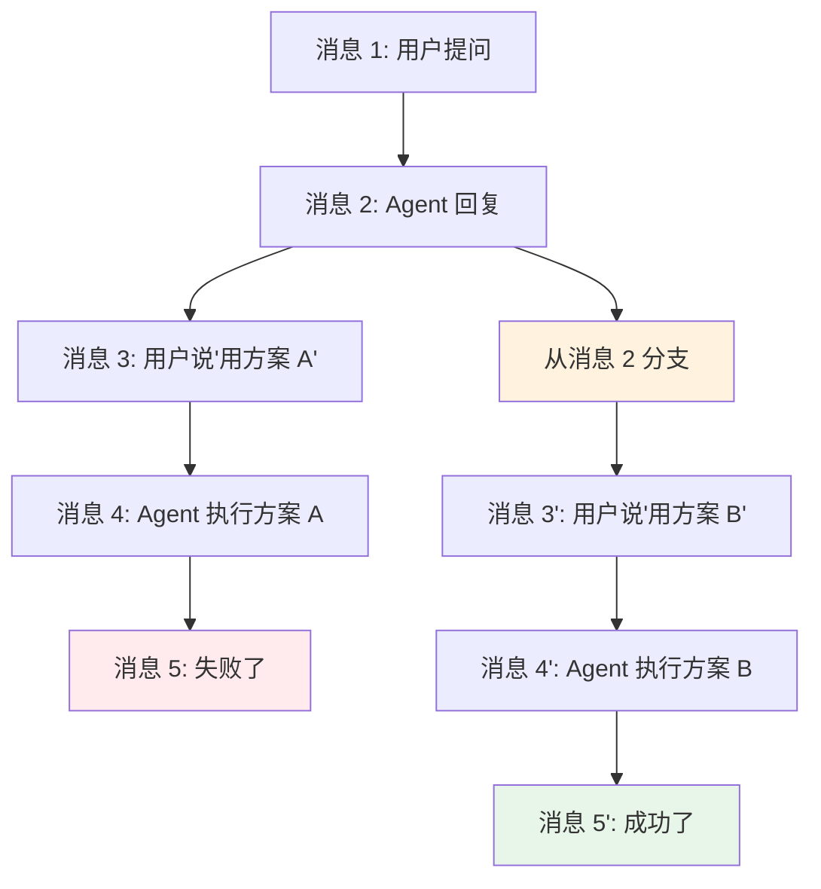
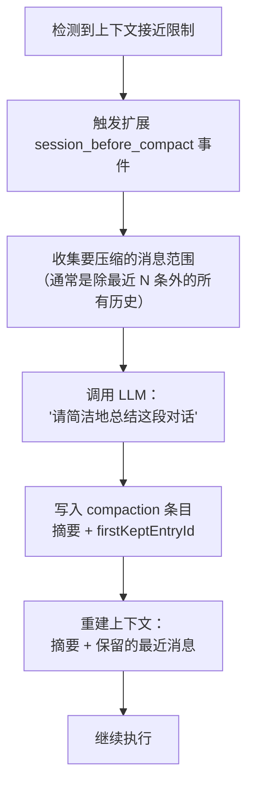

# 第 7 章：会话管理与上下文压缩

> [第 6 章](ch06-extensions.md)展示了扩展系统如何让 Agent 的能力无限扩展。但有一个问题随着对话的深入越来越严重：LLM 的上下文窗口是有限的（即使是 200K token 的模型也会耗尽），而一次编程会话可能包含几十次工具调用和大量文件内容。Pi 的会话管理系统同时解决两个问题：**持久化**（关掉终端也不丢失对话）和**压缩**（在上下文窗口满之前释放空间）。

---

## 会话持久化：JSONL 格式

Pi 使用 JSONL（JSON Lines）格式保存会话——每行一个 JSON 对象。这个选择有实用理由：

| 特性 | JSONL 的优势 |
|------|-------------|
| **追加写入** | 新消息直接追加到文件末尾，不需要读取-修改-写回整个文件 |
| **流式读取** | 恢复会话时逐行解析，内存友好 |
| **中断安全** | 即使进程中途崩溃，已写入的行仍然完整 |
| **可读性** | 人类可以直接阅读和调试 |

### 会话条目类型

会话文件中的每一行都是以下类型之一：

| 条目类型 | 含义 | 包含数据 |
|---------|------|---------|
| `session` | 会话头部（第一行） | ID、时间戳、工作目录、父会话引用 |
| `message` | 一条对话消息 | UserMessage / AssistantMessage / ToolResultMessage |
| `model_change` | 模型切换记录 | 新模型的 provider + modelId |
| `thinking_level_change` | 思考级别切换 | 新的 ThinkingLevel |
| `compaction` | 压缩记录 | 摘要文本 + 被压缩的范围 |
| `branch_summary` | 分支点摘要 | 分支前的对话概要 |
| `custom` | 扩展自定义数据 | 任意 customType + data |

一个典型的会话文件看起来像这样：

```
{"type":"session","id":"abc123","timestamp":1711567200000,"cwd":"/project"}
{"type":"message","message":{"role":"user","content":[{"type":"text","text":"读取 src/main.ts"}]}}
{"type":"message","message":{"role":"assistant","content":[...],"stopReason":"toolUse"}}
{"type":"message","message":{"role":"toolResult","toolName":"read","content":[...]}}
{"type":"message","message":{"role":"assistant","content":[...],"stopReason":"stop"}}
{"type":"model_change","provider":"openai","modelId":"gpt-4o"}
{"type":"message","message":{"role":"user","content":[...]}}
...
```

### 上下文重建

当恢复一个会话时，SessionManager 的 `buildSessionContext()` 逐行读取 JSONL 文件，重建完整的对话历史：

```
读取 JSONL 文件
  ↓
遍历每一行：
  session   → 提取元信息（ID、工作目录）
  message   → 追加到消息列表
  compaction → 用摘要替换被压缩的旧消息
  model_change → 记录当前模型
  thinking_level_change → 记录当前思考级别
  branch_summary → 作为上下文前缀
  ↓
输出：重建后的 AgentMessage[] + 当前模型 + 当前思考级别
```

压缩条目（compaction）的处理尤其重要——如果会话中有压缩记录，重建时会用摘要替换被压缩掉的旧消息，而不是加载那些已经被压缩的原始消息。这大幅减少了恢复时间和内存占用。

---

## 会话分支

编程对话经常需要"试错"：尝试一种方案，如果不行就退回来试另一种。Pi 的分支（Fork）功能就是为此设计的。



**分支的实现原理：**

1. 用户选择从某个历史消息点分支（`--fork` 或 `/fork` 命令）
2. SessionManager 创建一个新的 JSONL 文件
3. 新文件的 `session` 头部记录 `parentSession` 引用（指向原会话文件 + 分支点位置）
4. 在分支点之前的所有消息被复制到新文件（或通过引用共享）
5. 分支点之后的内容生成一条 `branch_summary` —— 用 LLM 总结"被跳过的分支做了什么"，帮助 Agent 理解上下文
6. 新会话从分支点继续，用户可以走不同的方向

分支摘要（branch_summary）的关键作用：Agent 在新分支中需要知道"之前有一条分支尝试了方案 A 但失败了"，这样它才能避免重蹈覆辙。LLM 自动生成这个摘要，插入为新分支的上下文前缀。

---

## 上下文压缩（Compaction）

这是会话管理中技术含量最高的部分。当对话历史接近 LLM 的上下文窗口限制时，需要在**不丢失关键信息**的前提下释放空间。

### 压缩何时触发

| 触发方式 | 条件 |
|---------|------|
| **自动压缩** | 当 Agent 发现上下文 token 数超过阈值（由 `compactionSettings` 配置）时自动触发 |
| **手动压缩** | 用户执行 `/compact` 命令 |
| **溢出恢复** | 当 LLM 返回"上下文太长"错误时，自动尝试压缩并重试 |

### 压缩的工作流程



**逐步拆解：**

**1. 消息范围选择**：压缩不是全部删除——它保留最近的几条消息（通常是最近一轮的 Turn），只压缩之前的历史。这确保 Agent 仍然记得"刚刚在做什么"。

**2. LLM 总结**：被压缩的消息被发送给 LLM，附上指令："请简洁地总结这段对话的关键信息，包括已完成的任务、发现的问题、做出的决策和当前状态。"

**3. 写入记录**：摘要作为 `compaction` 条目写入 JSONL。条目中的 `firstKeptEntryId` 记录了"从哪条消息开始保留原始内容"——这让会话重建时知道用摘要替换到哪里。

**4. 上下文重建**：压缩后的消息历史变为：`[摘要消息] + [保留的最近消息]`。对 LLM 来说，摘要消息看起来就像一条普通的对话记录——它不知道（也不需要知道）背后有几十条被压缩的消息。

### 压缩的代价

压缩是有损的——细节会丢失。比如压缩前 Agent 记得"文件第 47 行有一个 bug"，压缩后可能只记得"某处有一个 bug"。这就是为什么 Pi 不会过早压缩，而是尽可能利用完整的上下文窗口。

---

## 会话存储位置

| 位置 | 路径 | 用途 |
|------|------|------|
| 全局 | `~/.pi/agent/sessions/` | 默认存储位置 |
| 项目本地 | `.pi/sessions/` | 项目相关会话（需配置启用） |

会话文件名使用时间戳和随机 ID，保证唯一性。`--session` 参数可以用完整路径或 ID 前缀来引用会话。

---

## 小结

Pi 的会话管理系统解决了 Agent 长期使用的三个核心需求：

| 需求 | 解决方案 | 技术要点 |
|------|---------|---------|
| **不丢失对话** | JSONL 追加写入 | 流式持久化、中断安全 |
| **多方向探索** | 会话分支 + 分支摘要 | LLM 生成的分支上下文 |
| **上下文窗口限制** | 自动/手动压缩 | LLM 总结 + 范围标记 + 上下文重建 |

到这里，我们已经完整剖析了 coding-agent 的核心子系统：工具（[第 5 章](ch05-tools.md)）、扩展（[第 6 章](ch06-extensions.md)）、会话（本章）。接下来我们转向 UI 体系——[第 8 章](ch08-tui-engine.md)将深入 pi-tui，看看它如何用"差分渲染"在终端中实现高效的图形界面。

---

### 质检报告

**讲解节奏**
- [x] 先讲"为什么需要会话管理"再讲实现
- [x] JSONL → 分支 → 压缩，按复杂度递进

**周边知识**
- [x] 解释了 JSONL 格式的选择原因
- [x] 解释了压缩的有损特性和代价

**讲透了吗**
- [x] JSONL 条目类型完整
- [x] 上下文重建的处理逻辑清晰
- [x] 分支的实现原理（parentSession + branch_summary）
- [x] 压缩的 4 步完整拆解
- [x] 没有跳步

**代码纪律**
- [x] 全章代码片段 1 处（JSONL 示例——不是可执行代码，是数据格式演示，不贴则无法理解格式）
- [x] 其余全部使用调用路径和图表

**流程图准确性**
- [x] 分支图基于 session-manager.ts 的 forkFrom 逻辑确认
- [x] 压缩流程基于 compaction.ts 的 performCompaction 逻辑确认
- [x] 条目类型基于 session-manager.ts 的 SessionEntry 类型确认

**过渡自然吗**
- [x] 章头衔接第 6 章（"扩展让能力无限，但上下文窗口有限"）
- [x] 章尾引出第 8 章（"转向 UI 体系"）
- [x] JSONL → 分支 → 压缩 自然递进

**准确吗**
- [x] 条目类型名称经 session-manager.ts 确认
- [x] compaction 字段（firstKeptEntryId）经源码确认
- [x] 压缩触发条件经 agent-session.ts 确认

**读得下去吗**
- [x] JSONL 示例直观展示文件格式
- [x] 分支用图形化展示
- [x] 压缩流程用流程图清晰展示

**勘误建议**
- 无
