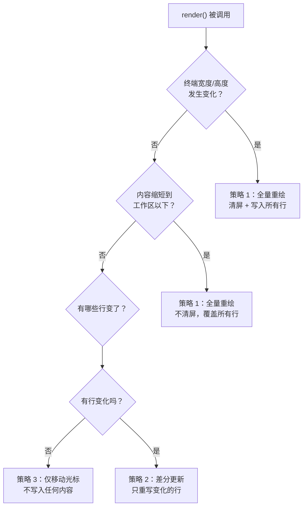

# 第 8 章：pi-tui —— 终端渲染引擎

> 前面七章我们深入了 Pi 的"大脑"（LLM 调用、Agent 循环、会话管理）和"手"（工具系统、扩展系统）。这一章我们转向"脸"——用户在终端中看到的一切。pi-tui 是一个独立的终端 UI 渲染引擎，coding-agent 的交互模式完全建立在它之上。

---

## 终端 UI 的核心难题

在终端中构建图形界面比在浏览器中困难得多，因为终端有三个独特约束：

| 约束 | 问题 | pi-tui 的解决方案 |
|------|------|-----------------|
| **无局部刷新 API** | 终端只能"写入字符"，没有"只更新第 5 行"的 API | 差分渲染——记住上一帧，只重写变化的行 |
| **字符宽度不一致** | CJK 字符占 2 格，Emoji 占 2 格，ANSI 转义码占 0 格 | 精确的 Unicode 宽度计算引擎 |
| **键盘输入碎片化** | 转义序列可能分多次到达（如 `\x1b` 先到，`[A` 后到） | 输入缓冲区 + 序列完整性检测 |

pi-tui 约 6,100 行代码，解决了这三个问题。

---

## 差分渲染引擎

这是 pi-tui 最核心的技术。传统做法是每次更新都清屏重绘——但这会导致严重闪烁。pi-tui 的方案是：**记住上一帧的每一行，只重新绘制变化的行。**

### 渲染策略选择

每次渲染时，引擎根据情况选择三种策略之一：



**策略 1：全量重绘**——当终端尺寸变化时（因为文本换行方式完全改变了），或者内容大幅缩短时。这是最昂贵但也是最安全的策略。

**策略 2：差分更新**——最常见的情况。引擎扫描新旧两帧的每一行，找到第一行变化（firstChanged）和最后一行变化（lastChanged），只重写这个范围内的行。对于"LLM 正在逐字输出"这种场景，通常只有最后一两行在变化。

**策略 3：仅光标移动**——如果没有任何行变化（比如只是光标位置改了），只发送光标定位指令。

### 同步输出协议

即使是差分更新，快速连续写入多行也可能产生可见的"撕裂"效果。pi-tui 使用**同步更新协议**（CSI 2026h/l）：

```
发送 "\x1b[?2026h"  ← 告诉终端"接下来的内容是一组，请攒着不要显示"
写入所有变化的行
发送 "\x1b[?2026l"  ← 告诉终端"这组内容结束了，现在一次性显示"
```

支持该协议的终端（如 iTerm2、kitty、WezTerm）会把中间的所有写入攒成一帧，一次性刷新——完全无闪烁。不支持的终端会忽略这两个控制码，退化为逐行刷新。

---

## 组件系统

pi-tui 的 UI 构建方式是**组件化**——每个 UI 元素是一个实现了 Component 接口的对象。

### Component 接口

每个组件需要实现：

| 方法 | 说明 |
|------|------|
| `render(width): string[]` | 给定宽度，返回渲染后的行数组 |
| `handleInput?(data): void` | 处理键盘输入（可选） |
| `invalidate(): void` | 清除缓存，下次渲染时重新计算 |

`render()` 方法是纯函数——给定宽度，返回行。这让组件可以被随意组合和嵌套。

### Container：组件的容器

Container 是最简单的布局组件——它持有一组子组件，渲染时按顺序拼接每个子组件的输出行。整个 TUI 的根节点就是一个 Container。

```
Container（根）
├── Text（欢迎信息）
├── AssistantMessage 组件（LLM 回复）
├── ToolExecution 组件（工具调用展示）
├── Editor 组件（用户输入框）
└── Footer 组件（状态栏）
```

### 内置组件

| 组件 | 用途 | 特性 |
|------|------|------|
| **Text** | 多行文本显示 | 自动换行、ANSI 颜色保持、背景色 |
| **TruncatedText** | 单行文本 | 超长自动加省略号 |
| **Editor** | 多行文本编辑器 | 换行、语法高亮、自动补全、Undo/Redo |
| **Input** | 单行输入框 | 水平滚动、历史记录、Kill Ring |
| **SelectList** | 可搜索的选择列表 | 过滤、滚动、项目描述 |
| **SettingsList** | 设置菜单 | 键值对、可编辑 |
| **Box** | 带边框的容器 | 主题化边框样式 |
| **Markdown** | Markdown 渲染 | 标题、代码块、列表的终端渲染 |
| **Image** | 图片显示 | Kitty/iTerm2 图片协议 |
| **Loader** | 加载动画 | 旋转点动画 |

---

## Overlay 浮层系统

有些 UI 元素需要"浮"在内容之上——比如模型选择器对话框、自动补全菜单。pi-tui 的 Overlay 系统解决这个需求。

### Overlay 的工作原理

Overlay 不是简单地覆盖底层内容。它需要：

1. **精确定位**：计算 Overlay 应该出现在屏幕的哪个位置
2. **内容合成**：把 Overlay 的内容和底层内容逐行合成——Overlay 覆盖的区域显示 Overlay，其余显示底层
3. **焦点管理**：多个 Overlay 时，最上层接收键盘输入

### 定位系统

Overlay 支持多种定位方式：

| 定位方式 | 说明 | 使用场景 |
|---------|------|---------|
| `anchor: "center"` | 屏幕正中 | 对话框 |
| `anchor: "top-left"` | 左上角 | 菜单 |
| `row` + `col` | 绝对行列 | 精确定位 |
| 百分比 | `"50%"` | 响应式定位 |

Overlay 还支持 `margin`（与终端边缘的最小距离）和 `maxHeight`（最大高度限制）。

### 合成过程

渲染时，TUI 引擎先渲染底层内容，然后按 Z 顺序（focusOrder）从下到上合成每个 Overlay：

```
底层内容行
  ↓
对每个可见 Overlay（按 Z 顺序）：
  — 计算 Overlay 的位置和尺寸
  — 渲染 Overlay 组件 → 获得 Overlay 行
  — 逐行合成：
    — 该行在 Overlay 范围外 → 保持底层内容
    — 该行在 Overlay 范围内 → 拼接：底层左侧 + Overlay 内容 + 底层右侧
  ↓
最终合成结果
```

`compositeLineAt()` 函数处理单行合成——它需要精确计算 ANSI 颜色码跨越的区域，确保 Overlay 边界处颜色正确切换。这是 pi-tui 中最精密的代码之一。

---

## 文本宽度计算

终端中每个字符占用的列数不同。正确计算"这段文字在终端中占几列"是所有渲染、换行、截断的基础。

### 宽度规则

| 字符类型 | 宽度 | 举例 |
|---------|------|------|
| ASCII 可打印字符 | 1 | `a`, `Z`, `!` |
| CJK 字符 | 2 | `中`, `あ`, `한` |
| Emoji | 2 | `😀`, `🎉` |
| 零宽字符 | 0 | 组合标记、ZWJ |
| ANSI 转义码 | 0 | `\x1b[31m`（红色） |
| Tab | 3（pi-tui 规定） | `\t` |

### visibleWidth()：核心宽度函数

这个函数计算一段文本的可见宽度，是 pi-tui 中调用频率最高的函数：

**调用路径：**

```
packages/tui/src/utils.ts::visibleWidth(text)
  — 快速路径：如果全是 ASCII → 直接返回字符串长度（极快）
  — 慢速路径：
    — 跳过所有 ANSI 转义码（颜色、光标控制等）
    — 用 Intl.Segmenter 按 grapheme（书写单元）分段
    — 对每个 grapheme 调用 graphemeWidth()
      — ASCII → 1
      — East Asian Wide（CJK）→ 2
      — Emoji 检测 → 2
      — 控制字符 → 0
    — 累加宽度
  — 输出：整数宽度
```

为了性能，visibleWidth() 对非 ASCII 字符串维护了一个 LRU 缓存（最多 512 条），避免重复计算。

### 文本换行和截断

基于 visibleWidth()，pi-tui 提供了两个关键操作：

**wrapTextWithAnsi(text, maxWidth)**：自动换行——在不超过 maxWidth 的前提下，按单词边界断行。关键难点是 ANSI 颜色码需要跨行保持——如果第一行以红色结束，第二行开头需要重新开启红色。

**truncateToWidth(text, maxWidth, ellipsis?)**：截断——超过 maxWidth 时截断并添加省略号。同样需要正确处理 ANSI 码，确保截断点的颜色被正确重置。

---

## 键盘输入处理

终端的键盘输入以转义序列的形式到达。pi-tui 支持两种键盘协议：

### 传统终端序列

| 按键 | 序列 | 说明 |
|------|------|------|
| 上箭头 | `\x1b[A` | CSI + A |
| Ctrl+C | `\x03` | ASCII 控制码 |
| F1 | `\x1b[11~` | CSI + 编号 |
| Enter | `\r` | 回车 |

### Kitty 键盘协议

现代终端支持的扩展协议，解决了传统序列的歧义问题。格式为 `\x1b[keycode;modifiers;eventtype u`，提供：
- 无歧义的按键识别
- 修饰键的完整组合（Shift、Alt、Ctrl、Super）
- 按键释放事件（用于快捷键释放检测）

### 输入缓冲

转义序列可能分片到达（`\x1b` 先到，`[A` 过几毫秒后到）。StdinBuffer 类解决这个问题：

```
原始字节到达
  ↓
追加到缓冲区
  ↓
检查：当前缓冲区是否构成完整序列？
  — CSI 序列（\x1b[...）：检查终止字节（0x40-0x7E）
  — OSC 序列（\x1b]...）：检查终止标记（BEL 或 ST）
  — 普通字符：直接发出
  ↓
如果完整 → 发出 "sequence" 事件
如果不完整 → 等待更多字节（设置短超时，超时后按原样发出）
```

---

## 小结

pi-tui 用约 6,100 行代码实现了一个完整的终端 UI 引擎：

| 子系统 | 核心文件 | 解决的问题 |
|--------|---------|-----------|
| **差分渲染** | tui.ts | 无闪烁的终端刷新 |
| **组件系统** | components/ | 可组合的 UI 构建块 |
| **Overlay** | tui.ts | 浮层定位与合成 |
| **文本宽度** | utils.ts | Unicode 精确宽度计算 |
| **键盘输入** | keys.ts, stdin-buffer.ts | 多协议键盘解析 |

它是一个通用的终端 UI 库——虽然 Pi 是它的主要用户，但它可以用于构建任何终端应用。[第 9 章](ch09-interactive-mode.md)将展示 coding-agent 如何用 pi-tui 的这些能力搭建出 30+ 个组件的交互式终端 IDE。

---

### 质检报告

**讲解节奏**
- [x] 先讲"终端 UI 的核心难题"再讲解决方案
- [x] 差分渲染 → 组件 → Overlay → 文本宽度 → 键盘，按依赖关系排列

**周边知识**
- [x] 解释了同步更新协议的工作原理和兼容性
- [x] 解释了 Kitty 键盘协议与传统协议的区别
- [x] 解释了输入缓冲的必要性

**讲透了吗**
- [x] 三种渲染策略的选择逻辑完整
- [x] Overlay 合成的逐步过程
- [x] visibleWidth() 的快速/慢速路径
- [x] 输入缓冲的完整流程

**代码纪律**
- [x] 全章代码片段 0 处
- [x] 全部使用调用路径、表格和流程图

**流程图准确性**
- [x] 渲染策略选择基于 tui.ts 的 render() 方法确认
- [x] Overlay 合成流程基于 tui.ts 的 compositeLineAt() 确认
- [x] visibleWidth 流程基于 utils.ts 确认

**过渡自然吗**
- [x] 章头衔接前文（"转向'脸'——用户看到的一切"）
- [x] 章尾引出第 9 章（"30+ 组件的交互式终端 IDE"）
- [x] 各节以"解决什么问题"衔接

**准确吗**
- [x] 6,100 行代码经 wc -l 确认
- [x] 同步更新控制码经 tui.ts 确认
- [x] LRU 缓存大小（512）经 utils.ts 确认

**读得下去吗**
- [x] 终端约束用表格对比，直观
- [x] 每张图有文字讲解
- [x] 键盘序列用具体例子展示

**勘误建议**
- 无
