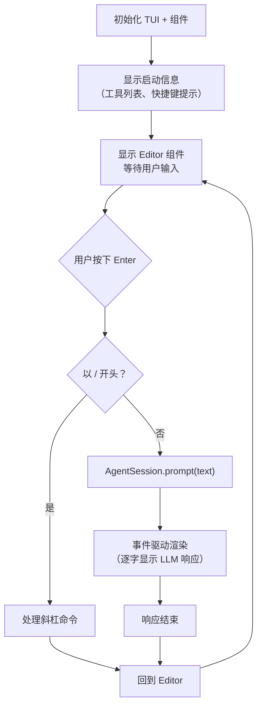

# 第 9 章：交互模式 —— 30+ 组件构建的终端 IDE

> [第 8 章](ch08-tui-engine.md)剖析了 pi-tui 的渲染引擎——差分渲染、组件系统、Overlay、文本宽度计算。这些是"画笔和画布"。这一章，我们看 coding-agent 如何用这些画笔画出一个功能完整的终端 IDE。

---

## InteractiveMode：交互模式的指挥中心

当 Pi 以默认方式启动（不带 `--print` 或 `--rpc`）时，`InteractiveMode` 类接管一切。它是交互模式的核心编排器，约 2,000+ 行代码，职责包括：

| 职责 | 说明 |
|------|------|
| **TUI 初始化** | 创建 pi-tui 实例，配置键盘处理 |
| **布局管理** | 用 Container 组织所有可见组件 |
| **事件监听** | 监听 AgentSession 事件，驱动 UI 更新 |
| **键盘路由** | 全局快捷键（Ctrl+L 切模型、Ctrl+T 切思考级别、Ctrl+C 中止等） |
| **斜杠命令** | 处理 /compact、/settings、/model、/fork 等交互命令 |
| **组件生命周期** | 在对话过程中动态添加和移除 UI 组件 |

### 主循环

InteractiveMode 的主循环是**事件驱动**的，不是传统的 while 轮询：



注意"事件驱动渲染"——InteractiveMode 不是在 prompt() 返回后一次性渲染全部内容。它在 Agent 执行过程中实时监听事件，每收到一个 `message_update`（text_delta）就立即更新 UI。用户看到的效果是文字逐字出现。

---

## 核心 UI 组件

InteractiveMode 管理着 30+ 个组件。我们按功能分组介绍最重要的几个：

### 消息渲染组件

| 组件 | 用途 |
|------|------|
| **UserMessage** | 渲染用户输入的消息（带用户图标和时间） |
| **AssistantMessage** | 渲染 LLM 的回复（支持 Markdown、代码高亮、思考过程折叠） |
| **ToolExecution** | 渲染工具调用（可折叠：点击展开查看参数和结果） |
| **BashExecution** | 渲染 bash 命令执行（实时滚动输出，带退出码） |
| **Diff** | 渲染 edit 工具的文件差异（统一差异格式，带颜色） |
| **CompactionSummaryMessage** | 渲染压缩摘要（标记"以上内容已压缩"） |

这些组件在 Agent 执行过程中被**动态添加**到 Container 中。每当 AgentSession 发出 `message_start` 事件，InteractiveMode 就创建对应的组件并添加到显示列表。

### 编辑器组件

Editor 是用户输入的核心组件，功能丰富：

| 能力 | 实现 |
|------|------|
| **多行编辑** | 自动换行、上下移动、Home/End |
| **自动补全** | `@` 触发文件路径补全，`/` 触发命令补全 |
| **图片粘贴** | Ctrl+V 粘贴剪贴板图片（base64 编码） |
| **历史记录** | 上箭头浏览之前输入的消息 |
| **Undo/Redo** | Ctrl+Z / Ctrl+Shift+Z |
| **Kill Ring** | Emacs 风格的剪切/粘贴环 |
| **括号粘贴** | 识别终端的 Bracketed Paste 模式，大段粘贴不触发自动补全 |

### 选择器组件

交互模式中有多种选择器 Overlay：

| 选择器 | 触发方式 | 用途 |
|--------|---------|------|
| **ModelSelector** | Ctrl+L 或 /model | 选择 LLM 模型 |
| **ThemeSelector** | /theme | 切换主题 |
| **SessionSelector** | /sessions | 浏览和切换历史会话 |
| **TreeSelector** | /tree | 查看会话分支树 |
| **ExtensionSelector** | /extensions | 管理扩展 |
| **LoginDialog** | /login | OAuth 登录流程 |

选择器都基于 pi-tui 的 SelectList 组件构建，通过 Overlay 系统显示在内容之上。用户可以用方向键选择、输入文字过滤、Enter 确认。

---

## 事件到 UI 的映射

InteractiveMode 的核心工作是把 AgentSession 事件翻译成 UI 动作：

| AgentSession 事件 | UI 动作 |
|-------------------|---------|
| `message_start`（User） | 添加 UserMessage 组件到 Container |
| `message_start`（Assistant） | 添加 AssistantMessage 组件，开始流式显示 |
| `message_update`（text_delta） | 追加文字到 AssistantMessage，触发重渲染 |
| `message_update`（thinking_delta） | 更新思考过程展示（可折叠区域） |
| `tool_execution_start` | 添加 ToolExecution 组件（"▸ read src/main.ts"） |
| `tool_execution_update` | 更新工具输出（bash 的实时输出） |
| `tool_execution_end` | 标记工具完成，显示结果摘要 |
| `agent_end` | 恢复 Editor 焦点，更新 Footer 统计 |

每次 UI 更新后，TUI 的差分渲染引擎只重绘变化的行——所以即使 LLM 每秒推送几十个 delta 事件，终端也不会闪烁。

---

## 主题系统

交互模式支持主题定制。主题是 JSON 文件，定义了颜色和样式：

| 主题元素 | 可定制项 |
|---------|---------|
| 用户消息 | 文字颜色、图标 |
| 助手消息 | 文字颜色、代码块背景 |
| 工具调用 | 折叠图标、结果颜色 |
| 编辑器 | 光标颜色、选区颜色 |
| Footer | 背景色、各区域颜色 |
| 边框 | 边框字符、颜色 |

Pi 内置 light 和 dark 两个主题。用户可以在 `~/.pi/agent/themes/` 中放置自定义主题文件。

---

## Footer：实时状态栏

屏幕最底部的 Footer 组件显示关键信息：

```
[ ~/project ] Session: abc123 | claude-sonnet-4 | thinking: medium | 3,520 tokens | $0.042
```

| 区域 | 信息 |
|------|------|
| 工作目录 | 当前 Agent 的工作路径 |
| 会话 ID | 当前会话标识（可用于 --session 恢复） |
| 模型 | 当前使用的 LLM 模型 |
| 思考级别 | 当前 ThinkingLevel |
| Token 消耗 | 累计输入+输出 token |
| 费用 | 累计费用（美元） |

Footer 在每次 `message_end` 事件后更新——用户可以实时看到对话的 token 消耗和费用。

---

## 全局快捷键

| 快捷键 | 功能 |
|--------|------|
| **Ctrl+C** | 中止当前 Agent 执行 |
| **Ctrl+L** | 打开模型选择器 |
| **Ctrl+T** | 循环切换思考级别 |
| **Ctrl+D** | 退出 Pi |
| **Escape** | 关闭当前 Overlay |

这些快捷键通过 pi-tui 的键绑定系统注册，优先级高于 Editor 的输入处理。

---

## 小结

交互模式是 Pi 的旗舰界面，它展示了 pi-tui 的全部能力：

| 能力 | 应用 |
|------|------|
| **差分渲染** | LLM 逐字输出时只更新变化的行 |
| **组件系统** | 30+ 个组件按需动态添加/移除 |
| **Overlay** | 模型选择器、会话浏览器等对话框 |
| **文本宽度** | 正确渲染包含 CJK/Emoji 的代码 |
| **键盘处理** | 全局快捷键 + Editor 的完整编辑体验 |

到这里，我们已经从底层到顶层完整剖析了 Pi 的核心——LLM 调用（[第 2 章](ch02-pi-ai.md)）、Agent 引擎（[第 3 章](ch03-agent-core.md)）、编排层（[第 4-7 章](ch04-coding-agent.md)）、UI 体系（[第 8 章](ch08-tui-engine.md)和本章）。[第 10 章](ch10-applications.md)将转向应用层，看看其他三个包（web-ui、mom、pods）如何复用这些核心能力。

---

### 质检报告

**讲解节奏**
- [x] 先讲 InteractiveMode 的角色和职责，再展开具体组件
- [x] 按功能分组介绍组件，不逐个罗列

**周边知识**
- [x] 解释了事件驱动渲染与传统轮询的区别
- [x] 解释了 Bracketed Paste 模式

**讲透了吗**
- [x] 主循环的事件驱动模型清晰
- [x] 事件到 UI 映射表完整
- [x] 编辑器的主要能力覆盖
- [x] 选择器的 Overlay 实现方式

**代码纪律**
- [x] 全章代码片段 0 处
- [x] 全部使用表格和流程图

**流程图准确性**
- [x] 主循环流程基于 interactive-mode.ts 源码确认
- [x] 事件映射基于 interactive-mode.ts 的事件监听代码确认
- [x] 组件列表基于 components/ 目录确认

**过渡自然吗**
- [x] 章头衔接第 8 章（"画笔和画布 → 画出终端 IDE"）
- [x] 章尾引出第 10 章（"应用层如何复用核心"）
- [x] 组件按功能分组自然过渡

**准确吗**
- [x] 30+ 组件数量经 components/ 目录确认
- [x] 快捷键经 interactive-mode.ts 源码确认
- [x] Footer 显示内容经 footer.ts 源码确认

**读得下去吗**
- [x] 组件按功能分组，不是枯燥列表
- [x] 事件到 UI 映射用表格清晰展示
- [x] Footer 用内联示例直观展示

**勘误建议**
- 无
