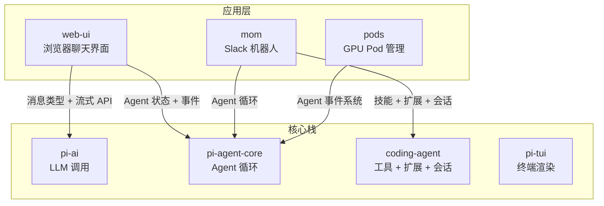
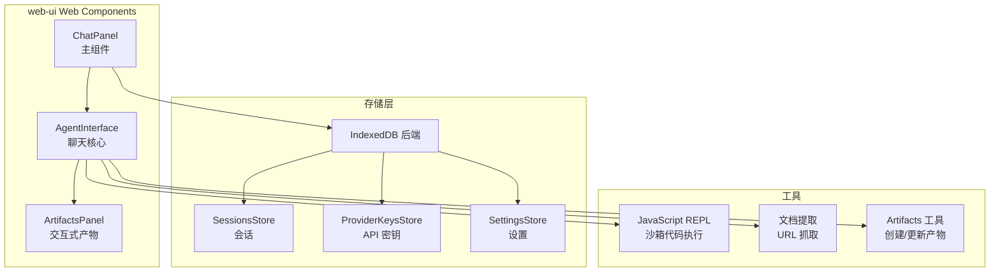
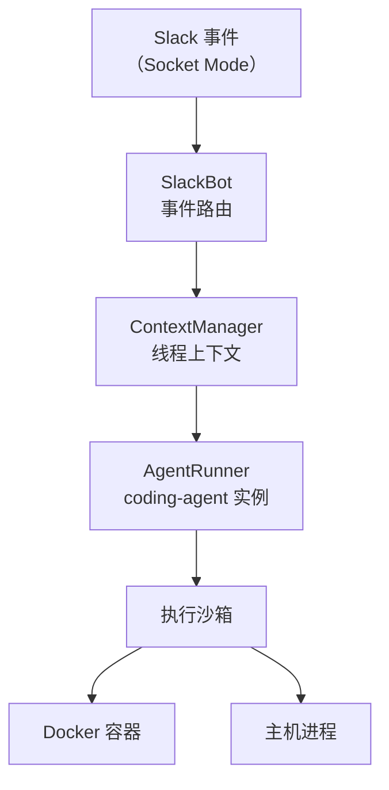
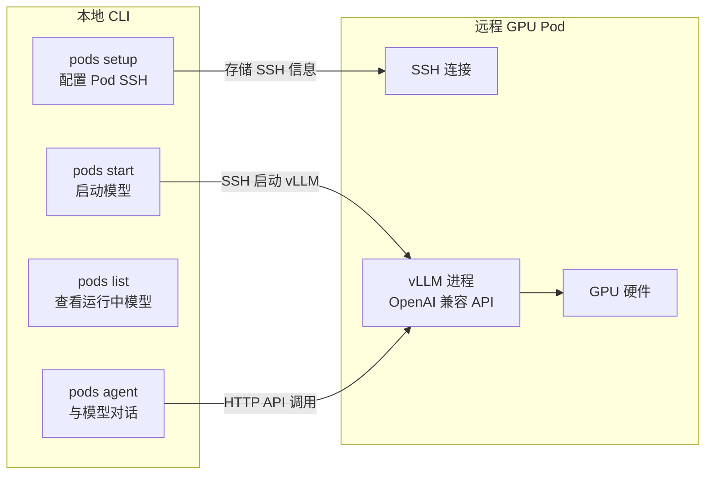

# 第 10 章：应用层 —— web-ui、mom、pods

> 前九章我们深入剖析了 Pi 的核心栈：LLM 抽象层、Agent 运行时、coding-agent 的编排和工具、TUI 渲染引擎。这些构成了 Pi 的"内核"。这一章我们看应用层的三个包——它们各自面向不同的使用场景，但都复用了核心栈的能力。

---

## 三个应用，一套内核

| 应用 | 用户界面 | 运行环境 | 核心依赖 |
|------|---------|---------|---------|
| **web-ui** | 浏览器 Web Components | 浏览器 | pi-ai + pi-agent-core |
| **mom** | Slack 消息 | Node.js 服务器 + Docker | coding-agent + pi-agent-core |
| **pods** | CLI 命令 | 本地终端（SSH 到远程 GPU） | pi-agent-core |

---

## web-ui：浏览器中的 AI 聊天

web-ui 提供了一套可嵌入的 Web Components，让你在任意网页中添加 AI 聊天界面。

### 架构

**核心组件：**

| 组件 | 职责 |
|------|------|
| **ChatPanel** | 高层入口——组合了聊天界面和 Artifacts 面板 |
| **AgentInterface** | 底层聊天核心——消息列表、输入框、文件上传 |
| **ArtifactsPanel** | 展示 LLM 生成的交互式产物（HTML/SVG/Markdown/JSON），用沙箱 iframe 隔离执行 |

**存储层**使用浏览器的 IndexedDB，提供会话持久化、API 密钥安全存储、用户设置管理。

**特色工具：**
- **JavaScript REPL**：在沙箱 iframe 中执行 LLM 生成的 JavaScript 代码，类似终端的 bash 工具
- **Artifacts**：LLM 可以创建交互式 HTML 产物（图表、可视化、小工具），在沙箱中安全渲染

web-ui 使用 mini-lit（轻量 LitElement）构建 Web Components，CSS 使用 Tailwind v4。

---

## mom：自管理的 Slack 机器人

mom 把 coding-agent 的完整能力接入了 Slack——团队可以在 Slack 频道中直接与 AI 编程助手对话。

### 架构

**关键特性：**

| 特性 | 说明 |
|------|------|
| **线程隔离** | 每个 Slack 线程是一个独立会话，互不干扰 |
| **Docker 沙箱** | bash 命令在 Docker 容器中执行，保护主机安全 |
| **自安装技能** | 需要的 CLI 工具（如 fd, ripgrep）自动安装 |
| **文件操作** | 支持读写文件、上传文件到 Slack 线程 |
| **定时任务** | 支持 cron 风格的定期执行任务 |
| **Artifacts 服务** | 可以生成 HTML 可视化并通过 URL 分享到 Slack |

mom 通过 Slack Socket Mode（WebSocket 长连接）接收事件。当收到 `@mention` 或私聊消息时，找到对应线程的 AgentRunner，调用 coding-agent 处理。coding-agent 的工具执行（bash、文件操作）在 Docker 容器内完成——这是 mom 的安全边界。

---

## pods：GPU Pod 上的模型部署

pods 是一个 CLI 工具，帮助用户在 GPU Pod 上部署和管理 vLLM（一个高性能 LLM 推理引擎）实例。

### 核心功能

| 命令 | 用途 |
|------|------|
| `pods setup <name> "<ssh>"` | 注册一个 GPU Pod（保存 SSH 连接信息） |
| `pods start <model>` | 在 Pod 上启动 vLLM 服务某个模型 |
| `pods stop` | 停止运行中的模型 |
| `pods list` | 查看所有运行中的模型和端口 |
| `pods agent <model> "prompt"` | 直接与部署的模型对话 |
| `pods agent <model> -i` | 进入交互对话模式 |

**预配置模型**：pods 内置了多个模型的 vLLM 配置——Qwen2.5-Coder、GPT-OSS、GLM-4.5 等。每个配置包含正确的 vLLM 启动参数、GPU 内存分配、上下文窗口大小。用户不需要了解 vLLM 的复杂参数，直接 `pods start qwen` 就能启动。

模型启动后暴露 OpenAI 兼容的 HTTP API——意味着可以被 pi-ai 作为自定义 Provider 使用，形成闭环。

---

## 小结

三个应用层包展示了 Pi 核心栈的灵活性：

| 场景 | 应用 | 用户交互 | 代码执行 |
|------|------|---------|---------|
| 个人编程 | coding-agent（终端 TUI） | 终端键盘 | 本地文件系统 |
| 网页集成 | web-ui（浏览器） | 鼠标/触摸 | 沙箱 iframe |
| 团队协作 | mom（Slack 机器人） | Slack 消息 | Docker 容器 |
| 模型部署 | pods（CLI） | 命令行 | 远程 GPU Pod |

同一套 Agent 循环、同一套消息类型、同一套 LLM 调用——适配到四种完全不同的运行环境。

[第 11 章](ch11-end-to-end.md)将用三个关键场景做端到端追踪，串联全书所有知识。

---

### 质检报告

**讲解节奏**
- [x] 先用图表总览三个应用的定位，再逐个展开
- [x] 每个应用先讲"它是什么"再讲架构

**周边知识**
- [x] 解释了 Socket Mode、Docker 沙箱、vLLM 的基本概念
- [x] 没有过度展开（这些是独立应用，详细架构留给各自的文档）

**讲透了吗**
- [x] web-ui 的组件层次和存储架构
- [x] mom 的线程隔离和 Docker 安全模型
- [x] pods 的命令体系和预配置模型
- [x] 四种运行环境的对比

**代码纪律**
- [x] 全章代码片段 0 处
- [x] 全部使用表格和流程图

**流程图准确性**
- [x] web-ui 架构基于 ChatPanel.ts 和 storage/ 目录确认
- [x] mom 架构基于 slack.ts 和 sandbox.ts 确认
- [x] pods 命令基于 cli.ts 确认

**过渡自然吗**
- [x] 章头衔接前文（"内核剖析完毕，转向应用层"）
- [x] 章尾引出第 11 章（"端到端追踪"）
- [x] 三个应用以对比方式自然过渡

**准确吗**
- [x] Web Components 技术栈经 package.json 确认
- [x] Slack Socket Mode 经 slack.ts 确认
- [x] 预配置模型经 model-configs.ts 确认

**读得下去吗**
- [x] 总览表格清晰对比
- [x] 每张图有文字讲解

**勘误建议**
- 无
