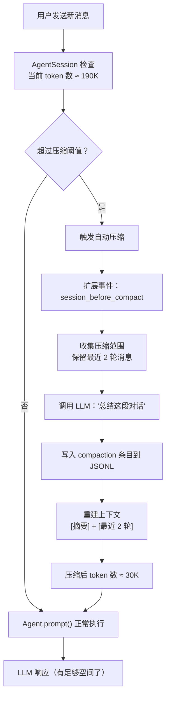

# 第 11 章：端到端追踪 —— 三个关键场景

> 前十章我们从全景到细节，逐层剖析了 Pi 的每个组件。这一章，我们换一个视角——**沿着数据流，跨越所有层级，完整追踪三个关键场景**。这既是对全书知识的串联，也是对理解的验收。

---

## 场景一：编辑文件（edit 工具的完整旅程）

用户在 Pi 中说："把 src/config.ts 里的 `maxRetries = 3` 改成 `maxRetries = 5`"。

### 完整追踪

```mermaid
sequenceDiagram
    participant U as 用户
    participant TUI as InteractiveMode
    participant AS as AgentSession
    participant A as Agent
    participant Loop as AgentLoop
    participant LLM as Anthropic API
    participant Edit as edit 工具

    U->>TUI: 输入文本
    TUI->>AS: prompt("把...改成...")
    AS->>AS: buildSystemPrompt()
    AS->>AS: 触发 before_agent_start
    AS->>A: prompt([UserMessage])
    A->>Loop: runAgentLoop()
    Loop->>Loop: convertToLlm() → Message[]
    Loop->>LLM: streamSimple(model, context)
    LLM-->>Loop: AssistantMessage + ToolCall(edit)
    Loop->>Loop: validateToolArguments(editSchema)
    Loop->>AS: beforeToolCall 钩子
    Loop->>Edit: execute({path, oldText, newText})
    Edit->>Edit: 读取文件 → 精确匹配 oldText
    Edit->>Edit: 替换 → 写入文件 → 生成 diff
    Edit-->>Loop: ToolResultMessage(diff 输出)
    Loop->>LLM: streamSimple(含工具结果)
    LLM-->>Loop: AssistantMessage("已完成修改")
    Loop->>A: agent_end
    A->>AS: 事件广播
    AS->>AS: 写入 JSONL 会话文件
    AS->>TUI: 渲染 diff + 最终回复
    TUI->>U: 显示结果
```

**跨层数据变化追踪：**

| 站点 | 数据形态 | 所在层 |
|------|---------|-------|
| 用户输入 | 纯文本字符串 | TUI |
| prompt() 入口 | `{ role: "user", content: [TextContent], timestamp }` | AgentSession |
| LLM 请求 | Anthropic `MessageParam[]` + `tools[]` | pi-ai Provider |
| LLM 响应 | `AssistantMessage { content: [TextContent, ToolCall] }` | pi-ai 统一事件流 |
| 工具参数 | `{ path: "src/config.ts", oldText: "maxRetries = 3", newText: "maxRetries = 5" }` | AgentLoop |
| edit 内部 | 文件内容 → indexOf 匹配 → 替换 → 写入 → unified diff | edit 工具 |
| 工具结果 | `ToolResultMessage { content: [TextContent(diff)] }` | AgentLoop |
| 二次 LLM | Anthropic 请求（含 tool_result） | pi-ai Provider |
| 最终响应 | `AssistantMessage { content: [TextContent("已完成")] }` | pi-ai |
| 持久化 | JSONL 追加 4 条消息 | SessionManager |
| UI 渲染 | Diff 组件（红/绿高亮） + Text 组件 | TUI |

如果精确匹配失败（比如 LLM 写成了 `maxRetries=3` 少了空格），edit-diff.ts 的模糊匹配管道会启动——对文件内容和 oldText 都做 NFKC 标准化 + 空白处理后再匹配（[详见第 5 章](ch05-tools.md)）。

---

## 场景二：扩展拦截工具调用

假设用户安装了一个安全扩展，要求所有 `bash` 命令在执行前需要确认。LLM 说"我要执行 `rm -rf node_modules`"。

### 完整追踪

```mermaid
sequenceDiagram
    participant LLM as LLM
    participant Loop as AgentLoop
    participant Ext as 安全扩展
    participant TUI as InteractiveMode
    participant U as 用户
    participant Bash as bash 工具

    LLM-->>Loop: ToolCall(bash, "rm -rf node_modules")
    Loop->>Loop: 提取 ToolCall，校验参数
    Loop->>Ext: beforeToolCall({ toolName: "bash", args: {...} })
    Ext->>TUI: ui.confirm("允许执行 rm -rf node_modules？")
    TUI->>U: 显示确认对话框
    U->>TUI: 点击"允许"
    TUI->>Ext: true
    Ext-->>Loop: undefined（允许执行）
    Loop->>Bash: execute("rm -rf node_modules")
    Bash-->>Loop: ToolResultMessage（命令输出）
    Loop->>Ext: afterToolCall({ result })
    Ext->>Ext: 记录审计日志
    Ext-->>Loop: undefined（不修改结果）
    Loop->>LLM: 继续（含工具结果）
```

**数据流经过的每一层：**

1. **AgentLoop** 从 AssistantMessage 中提取 ToolCall（[第 3 章](ch03-agent-core.md)的内层循环步骤 5）
2. **AgentLoop** 调用 `config.beforeToolCall()`——这个回调由 AgentSession 注入，它会转发给 ExtensionRunner
3. **ExtensionRunner** 查找所有注册了 `tool_call` 事件的扩展处理器，按顺序调用（[第 6 章](ch06-extensions.md)）
4. **安全扩展**通过 `ui.confirm()` 弹出 Overlay 确认框（[第 8 章](ch08-tui-engine.md)的 Overlay 系统）
5. 用户确认后，控制权回到 AgentLoop，正常执行 bash 工具（[第 5 章](ch05-tools.md)）
6. 执行后，`afterToolCall()` 同样经过扩展链——安全扩展在这里记录审计日志

**如果在 RPC 模式下**：`ui.confirm()` 被序列化为 JSON-RPC 消息发送给宿主进程（[第 4 章](ch04-coding-agent.md)），宿主进程在自己的 UI 中展示确认框，用户选择后通过 JSON-RPC 返回。扩展代码完全不需要修改——UI 抽象层处理了差异。

---

## 场景三：上下文溢出自动压缩

一次长对话已经进行了 50 轮，token 消耗接近模型的 200K 上下文窗口。用户发送下一条消息时触发自动压缩。

### 完整追踪



**关键数据变化：**

| 阶段 | 消息历史 | 估计 token |
|------|---------|-----------|
| 压缩前 | 50 轮 × (User + Assistant + ToolResults) ≈ 150 条消息 | ~190K |
| 压缩中 | 将前 146 条消息发给 LLM 总结 | — |
| 压缩后 | 1 条摘要消息 + 最近 4 条消息 = 5 条消息 | ~30K |
| 继续执行 | 5 条 + 新 User 消息 = 6 条消息 | ~31K |

**涉及的子系统：**

1. **AgentSession** 在每次 `message_end` 后检查 token 消耗（[第 4 章](ch04-coding-agent.md)）
2. **Compaction 模块** 选择压缩范围、调用 LLM 生成摘要（[第 7 章](ch07-sessions.md)）
3. **SessionManager** 写入 `compaction` 条目到 JSONL，标记 `firstKeptEntryId`（[第 7 章](ch07-sessions.md)）
4. **pi-ai** 的 `streamSimple()` 用于总结调用和后续正常调用（[第 2 章](ch02-pi-ai.md)）
5. **Agent 运行时** 通过 `transformContext` 钩子感知压缩后的上下文（[第 3 章](ch03-agent-core.md)）

压缩对用户是透明的——唯一可见的变化是 InteractiveMode 显示一个 CompactionSummaryMessage 组件（[第 9 章](ch09-interactive-mode.md)），告知"以上 48 轮对话已压缩为摘要"。

---

## 全书回顾

三个场景分别串联了 Pi 的不同系统：

| 场景 | 核心涉及章节 |
|------|------------|
| **编辑文件** | [第 2 章](ch02-pi-ai.md)（LLM 调用）→ [第 3 章](ch03-agent-core.md)（循环）→ [第 5 章](ch05-tools.md)（edit 工具）→ [第 7 章](ch07-sessions.md)（持久化）→ [第 8 章](ch08-tui-engine.md)（渲染） |
| **扩展拦截** | [第 3 章](ch03-agent-core.md)（beforeToolCall）→ [第 6 章](ch06-extensions.md)（事件钩子）→ [第 8 章](ch08-tui-engine.md)（Overlay）→ [第 4 章](ch04-coding-agent.md)（RPC 抽象） |
| **自动压缩** | [第 4 章](ch04-coding-agent.md)（阈值检测）→ [第 7 章](ch07-sessions.md)（压缩流程）→ [第 2 章](ch02-pi-ai.md)（LLM 总结）→ [第 9 章](ch09-interactive-mode.md)（UI 通知） |

如果你能跟着这三个场景，把数据从用户输入追踪到最终结果，经过的每一层你都能说清"这一层做了什么"——那么你已经真正理解了 Pi 的实现原理。

---

### 质检报告

**讲解节奏**
- [x] 每个场景先设定背景，再用时序图追踪，最后总结涉及的层

**周边知识**
- [x] 无需额外补充（全书知识在此串联）

**讲透了吗**
- [x] 场景一：edit 的完整 11 站数据变化表
- [x] 场景二：扩展拦截的 6 步事件链
- [x] 场景三：压缩前后的 token 变化量化对比
- [x] 每个场景都标注了涉及的章节

**代码纪律**
- [x] 全章代码片段 0 处
- [x] 全部使用时序图、流程图和表格

**流程图准确性**
- [x] 场景一的时序图基于 agent-loop.ts + edit.ts + agent-session.ts 源码确认
- [x] 场景二的时序图基于 beforeToolCall 机制和 ExtensionRunner 确认
- [x] 场景三的流程图基于 compaction.ts 和 agent-session.ts 确认

**过渡自然吗**
- [x] 章头说明"换视角串联全书"
- [x] 章尾以"全书回顾"收束
- [x] 三个场景以复杂度递增排列

**准确吗**
- [x] edit 工具的模糊匹配回退机制经源码确认
- [x] RPC 模式下 UI 序列化经 rpc-mode.ts 确认
- [x] 压缩的 firstKeptEntryId 机制经 session-manager.ts 确认

**读得下去吗**
- [x] 时序图直观展示跨层调用
- [x] 数据变化用表格追踪
- [x] 章节引用帮助回顾

**勘误建议**
- 无
